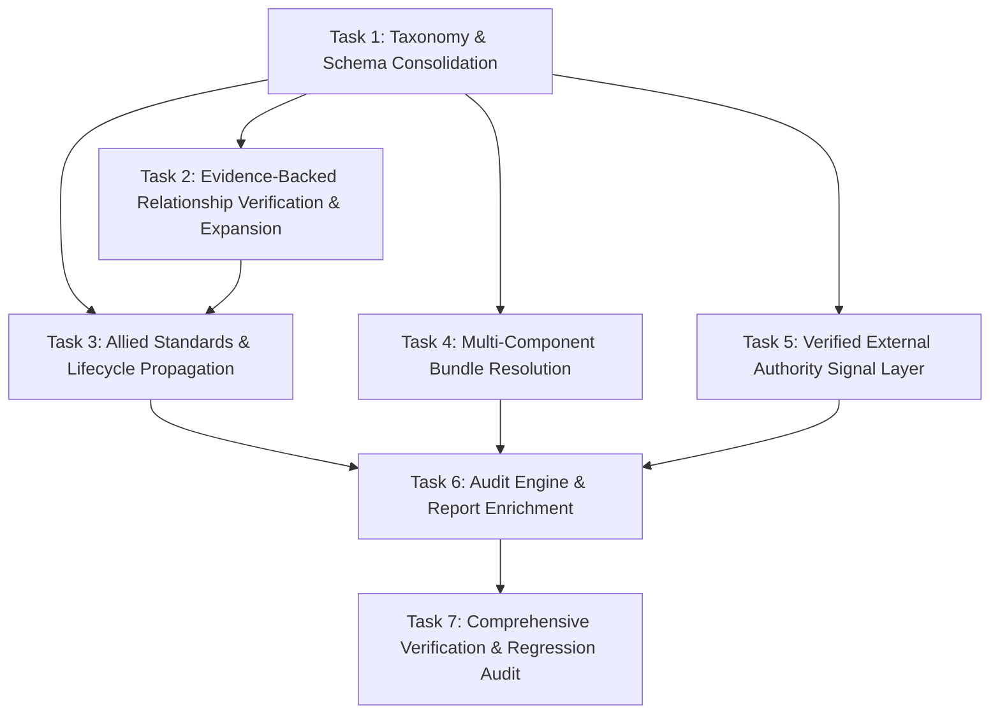

# Phase 9: Standards Relationship & Regulatory Intelligence — Implementation Plan

**Phase**: 09  
**Plan Revision**: Rev. 2 (Post-Review Convergence)  
**Baseline Commit**: `2bdaa79`  
**Execution Objective**: Extend TenderSaathi from isolated primary standard matching (`Requirement -> Applicable Indian Standard`) to a complete, multidimensional, evidence-backed standards and regulatory intelligence engine (`Requirement -> Primary Standard -> Normative References -> Test Methods -> Installation Codes -> Safety Standards -> Terminology Standards -> Allied Standards -> Lifecycle & Amendment Currency -> Certification & External Regulatory Signals -> Evidence & Provenance -> Human Review -> Tender Audit`) strictly aligned with SIH Problem Statement 26108, while preserving catalogue immutability, safety invariants, and the frozen benchmark.

---

## 1. Executive Summary & SIH26108 Alignment

The official problem statement for SIH26108 mandates:
> *“AI-Powered Recommendation Engine for Identifying Applicable Indian Standards for Procurement Specifications.”*

The mandated capability matrix explicitly demands:
1. Recommending applicable Indian Standards for procurement items.
2. Identifying allied standards and complementary specifications.
3. Extracting normative references cited within standards.
4. Distinguishing test methods and sampling procedures.
5. Identifying terminology standards, symbols, and glossaries.
6. Identifying safety standards and protective codes.
7. Identifying installation standards and codes of practice.
8. Mapping related product standards within the engineering assembly.
9. Tracking latest published versions, currency, and amendments.
10. Surfacing applicable certification schemes (ISI Mark, QCOs, CRS).
11. Multilingual input handling and technical semantic understanding.

Phase 9 operationalizes this mandate by consolidating graph schemas, expanding verified relationships across 5 demonstration domains subject to evidence availability, decomposing compound multi-component bundles, surfacing decoupled and verified statutory advisory signals (FSSAI, CEA, CPWD), propagating lifecycle currency into dependency trees, and enriching tender audit reporting.

---

## 2. Benchmark Source of Truth & Discrepancy Audit

### 2.1 Resolution of the 16/20 vs 18/20 Internal Discrepancy
- **Audit Findings**:
  - The repository's canonical ground truth benchmark is `dataset/ground_truth/ground_truth.csv` (20 rows: 15 single-standard requirements, 5 negative out-of-domain commodities).
  - In early Phase 8, Task 5 introduced an unconstrained generic pipe check that erroneously classified sanitary fittings (`T001-R002` Hubless drainage) and plumbing fittings (`T012-R003`) as generic pipes lacking material, dropping Top-1 accuracy temporarily to **80.0% (16/20)**.
  - In Phase 8 Task 6, `src/ambiguity.py` was refined so that `is_generic_pipe` strictly checks pipe conduits and excludes fittings, while `src/applicability.py` recognized sanitary drainage terminology, restoring Top-1 accuracy to **90.0% (18/20)**.
  - Evaluator output in `reports/feasibility/milestone2_evaluation_report.md` and `reports/feasibility/milestone2_evaluation.csv` confirms the active baseline:
    - **Top-1 Accuracy**: **18/20 (90.0%)** (with 2 legitimate safe abstentions: `T004-R002` non-standard compound item, `T010-R001` uncatalogued foreign spec)
    - **Top-3 Retrieval Recall**: **18/20 (90.0%)**
    - **Negative Rejection Rate**: **5/5 (100.0%)** (0 False Positives, 0.0% FPR)
    - **Supersedence Detection Rate**: **100.0%**
    - **Ambiguity Detection Recall**: **100.0%**
- **Phase 9 Benchmark Invariant**: The frozen 20-row benchmark must remain $\ge 18/20$ (90.0%) Top-1 accuracy, with 0 false positives on negative controls.

---

## 3. Architectural Invariants & Safety Guardrails

1. **BIS Catalogue & Database Immutability**:
   `data/catalogue/bis_catalogue.json` and `standards.db` remain 100% BIS Indian Standards. **No external statutory regulation (FSSAI, CEA, CPWD, ISO, IEC, DIN, ASTM) shall be inserted into `standards.db` or the BIS catalogue.**
2. **External Authority Decoupling & Verification**:
   External statutory bodies exist solely within `src/regulatory/external_authority.py` as an advisory signal layer (`ExternalAuthoritySignal`), tagged with non-legal disclaimers. Every statutory instrument, scope statement, and related BIS reference must be verified against official sources prior to integration. Zero hardcoded unverified mappings.
3. **Strict Relationship Provenance Invariant (No INFERRED in Production Graph)**:
   Production graph relationships may **only** be:
   - `VERIFIED`: Backed by official BSB Edge / portal records, Clause 2 citations, or foreword declarations.
   - `CURATED`: Extracted and verified from authoritative published BIS standard texts.
   
   **`INFERRED` is strictly prohibited from entering the production relationship graph.** Any relationship lacking verified or curated source evidence must be abstained/omitted.
4. **Relationship Expansion Execution Rule**:
   $$\mathbf{SOURCE\ EVIDENCE \longrightarrow VERIFY\ RELATIONSHIP \longrightarrow ADD\ TO\ GRAPH}$$
   Relationships are treated as **candidate relationships requiring source verification**, not already-verified facts. If a relationship cannot be verified from an acceptable source, it must **not** be added merely to reach an arbitrary numeric target.
5. **Relationship Numeric Target Consistency**:
   Target specification: **Expand verified relationship coverage across the five demonstration domains subject to evidence availability.** Report the actual verified relationship count at completion.
6. **Evidence Grounding Invariant**:
   $\text{candidate\_standard} == \text{evidence\_standard}$ on 100% of emitted primary recommendations.
7. **Graph Traversal Constraint**:
   Deterministic graph traversal remains strictly **depth = 1** from primary verified candidates to prevent combinatorial drift and spurious associations.
8. **No Probe-Specific Overrides / Phrase Hardcoding**:
   Zero `ADV-*` probe IDs, probe strings, or synthetic exceptions in production code. Zero dictionary mappings from requirement phrases directly to standard numbers. Candidate standards must be retrieved through catalogue indexing and semantic matching.
9. **Asset Immutability**:
   `dataset/ground_truth/`, `data/catalogue/`, and `dataset/adversarial/` remain 100% untouched.

---

## 4. Workstream Breakdown & Task Specifications



### Execution Sequence & Dependencies:
$$\mathbf{Task\ 1 \longrightarrow Task\ 2 \longrightarrow Task\ 3 \longrightarrow Task\ 4 \longrightarrow Task\ 5 \longrightarrow Task\ 6 \longrightarrow Task\ 7}$$

---

### Task 1: Taxonomy & Graph Schema Consolidation
- **Files Involved**: `src/standards.py`, `src/graph.py`, `src/dependencies.py`
- **Objective**: Consolidate disparate relationship strings and roles into a strictly typed, canonical taxonomy with backward-compatibility aliasing, and strictly enforce the `VERIFIED` or `CURATED` provenance constraint.
- **Implementation Specification**:
  1. Define canonical relationship types enum/constants in `src/standards.py` and `src/graph.py`:
     - `NORMATIVE_REFERENCE`: Mandatory clause 2 citations required for compliance.
     - `TEST_METHOD`: Standards defining test procedures, sampling, chemical/mechanical tests.
     - `INSTALLATION_CODE`: Codes of practice defining laying, jointing, erection, and execution.
     - `SAFETY_STANDARD`: Standards specifying safety clearances, protective devices, and hazard mitigations.
     - `TERMINOLOGY_STANDARD`: Glossaries, definitions, symbols, and letter notations.
     - `ALLIED_STANDARD`: Complementary components, fittings, flanges, gaskets, and sub-assemblies.
     - `SUPERSEDES`: Unidirectional historical succession.
     - `AMENDS`: Published technical amendments to the standard.
  2. Maintain backward-compatibility normalization for legacy values:
     - `CODE_OF_PRACTICE` $\rightarrow$ maps to `INSTALLATION_CODE`
     - `INSTALLATION_STANDARD` $\rightarrow$ maps to `INSTALLATION_CODE`
     - `CODE_OF_PRACTICE_FOR` $\rightarrow$ maps to `INSTALLATION_CODE`
     - `REFERENCES` $\rightarrow$ maps to `NORMATIVE_REFERENCE`
     - `SUPERSEDED_BY` $\rightarrow$ normalized as reverse edge of `SUPERSEDES`
  3. Ensure `StandardRelationship` dataclass in `src/graph.py` enforces:
     - `source_standard: str`
     - `target_standard: str`
     - `relationship_type: str` (validated against canonical types)
     - `evidence: str` (mandatory verbatim citation text)
     - `evidence_clause: Optional[str]` (e.g. "Clause 2", "Foreword", "Clause 8.1")
     - `provenance: str` (Must strictly be `VERIFIED` or `CURATED`; `INFERRED` is strictly rejected from production relationships)
     - `confidence: float`
     - `source: str` (e.g. `BSB_EDGE_MANUALLY_VERIFIED`, `BIS_OFFICIAL_CATALOGUE`)
- **Measurable Acceptance Criteria**:
  - All existing graph tests pass.
  - Zero unsupported relationship types emitted.
  - 100% of graph edges contain non-empty evidence.
  - **Zero `INFERRED` relationships in production relationship graph (100% `VERIFIED` or `CURATED`).**

---

### Task 2: Evidence-Backed Relationship Verification & Expansion (5 Demonstration Domains)
- **Files Involved**: `data/standards/relationships.json`
- **Objective**: Expand verified relationship coverage across the five demonstration domains subject to evidence availability, adhering strictly to:
  $$\mathbf{SOURCE\ EVIDENCE \longrightarrow VERIFY\ RELATIONSHIP \longrightarrow ADD\ TO\ GRAPH}$$
- **Execution Principle**:
  - The items below are **candidate relationships requiring source verification**, not already-verified facts.
  - Each candidate must be verified against Clause 2 Normative References, standard forewords, or official BIS committee documentation before insertion.
  - If a candidate relationship cannot be substantiated by acceptable source evidence, it must **not** be added merely to meet a target.
  - Report the actual verified relationship count at completion.
- **Candidate Relationships for Source Verification**:
  1. **Civil & Water Supply Candidates**:
     - `IS 458 : 2021` (Concrete pipes) $\rightarrow$ verify candidate links to `IS 783 : 1985` (Laying, `INSTALLATION_CODE`), `IS 3597 : 1998` (Testing, `TEST_METHOD`), `IS 5382` (Rubber sealing rings, `ALLIED_STANDARD`), `IS 269` / `IS 1489` (Cement, `NORMATIVE_REFERENCE`), `IS 432` / `IS 1786` (Steel reinforcement, `NORMATIVE_REFERENCE`).
     - `IS 15778 : 2007` (CPVC pipes) $\rightarrow$ verify candidate links to `IS 12235` (Test methods, `TEST_METHOD`), `IS 7634 Part 3` (Plastics pipe laying, `INSTALLATION_CODE`), `IS 4985` (PVC pipe comparison, `ALLIED_STANDARD`).
     - `IS 4985 : 2021` (UPVC pipes) $\rightarrow$ verify candidate links to `IS 12235` (Test methods, `TEST_METHOD`), `IS 7634 Part 3` (Installation, `INSTALLATION_CODE`), `IS 5382` (Rubber rings, `ALLIED_STANDARD`), `IS 10124` (PVC fittings, `ALLIED_STANDARD`).
     - `IS 1239 Part 1 : 2004` (Steel tubes) $\rightarrow$ verify candidate links to `IS 1239 Part 2 : 1992` (Steel pipe fittings, `ALLIED_STANDARD`), `IS 4736` (Galvanizing, `NORMATIVE_REFERENCE`), `IS 1387` (General delivery conditions, `NORMATIVE_REFERENCE`).
     - `IS 15905 : 2020` (Hubless cast iron soil pipes) $\rightarrow$ verify candidate links to `IS 3989` (Centrifugally cast pipes, `ALLIED_STANDARD`), `IS 5382` (Jointing gaskets, `ALLIED_STANDARD`), `IS 1729` (Sand cast drainage pipes, `SUPERSEDES`).
     - `IS 8329 : 2000` (Ductile iron pipes) $\rightarrow$ verify candidate links to `IS 12288 : 1987` (DI pipe laying code, `INSTALLATION_CODE`), `IS 9523 : 2000` (DI fittings, `ALLIED_STANDARD`), `IS 5382` (Rubber gaskets, `ALLIED_STANDARD`).
  2. **Electrical Distribution Candidates**:
     - `IS 7098 Part 1 : 1988` (XLPE cables $\le 1.1\text{ kV}$) $\rightarrow$ verify candidate links to `IS 1255 : 1983` (Cable installation code, `INSTALLATION_CODE`), `IS 10810` (Test methods, `TEST_METHOD`), `IS 8130 : 2013` (Conductors, `NORMATIVE_REFERENCE`), `IS 5831 : 1984` (PVC insulation/sheath, `NORMATIVE_REFERENCE`), `IS 3975 : 1999` (Mild steel armour, `NORMATIVE_REFERENCE`).
     - `IS 7098 Part 2 : 2011` (XLPE cables $3.3\text{ kV}$ to $33\text{ kV}$) $\rightarrow$ verify candidate links to `IS 1255 : 1983` (Installation, `INSTALLATION_CODE`), `IS 10810` (Test methods, `TEST_METHOD`), `IS 8130 : 2013` (Conductors, `NORMATIVE_REFERENCE`).
     - `IS 694 : 2010` (PVC cables $\le 1100\text{ V}$) $\rightarrow$ verify candidate links to `IS 732 : 2019` (Electrical wiring installations, `INSTALLATION_CODE`), `IS 10810` (Test methods, `TEST_METHOD`), `IS 8130 : 2013` (Conductors, `NORMATIVE_REFERENCE`).
     - `IS 3043 : 2018` (Code of practice for earthing) $\rightarrow$ verify candidate links to `IS 732 : 2019` (Wiring code, `NORMATIVE_REFERENCE`), `IS 2062` (Steel for earthing electrodes, `ALLIED_STANDARD`).
  3. **Mechanical & Fluid Control Candidates**:
     - `IS 14846 : 2000` (Sluice valves for waterworks) $\rightarrow$ verify candidate links to `IS 778 : 1984` (Copper alloy trim, `NORMATIVE_REFERENCE`), `IS 6392` (Flanges, `ALLIED_STANDARD`), `IS 1538` (Flanges, `ALLIED_STANDARD`), `IS 2712` (Gaskets, `ALLIED_STANDARD`), `IS 210` (Grey iron castings, `NORMATIVE_REFERENCE`).
     - `IS 778 : 1984` (Copper alloy gate/globe valves) $\rightarrow$ verify candidate links to `IS 2643` (Pipe threads, `NORMATIVE_REFERENCE`), `IS 318` (Leaded tin bronze, `NORMATIVE_REFERENCE`).
     - `IS/ISO 10434 : 2020` (Steel gate valves) $\rightarrow$ verify candidate links to `IS 10611 : 1983` (`SUPERSEDES`), `IS/ISO 15761` (Steel globe/check valves, `ALLIED_STANDARD`), `IS 6392` (Flanges, `ALLIED_STANDARD`).
  4. **Rotating Machinery & Drives Candidates**:
     - `IS/IEC 60034-1 : 2017` (Rotating electrical machines - Rating and performance) $\rightarrow$ verify candidate links to `IS 12615 : 2018` (Energy efficient induction motors, `ALLIED_STANDARD`), `IS 325 : 1996` (`SUPERSEDES`), `IS 12065` (Noise limits, `NORMATIVE_REFERENCE`), `IS 12075` (Vibration limits, `NORMATIVE_REFERENCE`), `IS 9283` (Motors for submersible pumpsets, `ALLIED_STANDARD`).
     - `IS 12615 : 2018` (Line-operated three-phase induction motors - Efficiency classes) $\rightarrow$ verify candidate links to `IS/IEC 60034-1` (Rating, `NORMATIVE_REFERENCE`), `IS/IEC 60034-2-1` (Loss and efficiency tests, `TEST_METHOD`).
     - `IS 8034 : 2018` (Submersible pumpsets) $\rightarrow$ verify candidate links to `IS 9283` (Submersible motors, `NORMATIVE_REFERENCE`), `IS 5120` (Pumps general requirements, `NORMATIVE_REFERENCE`), `IS 11346` (Submersible pump tests, `TEST_METHOD`).
     - `IS 5120 : 1977` (Centrifugal pumps for clear water) $\rightarrow$ verify candidate links to `IS 9079 : 2018` (Electric monobloc pumps, `ALLIED_STANDARD`), `IS 10981` (Pump testing, `TEST_METHOD`).
  5. **Substation & Power Equipment Candidates**:
     - `IS 1180 Part 1 : 2014` (Outdoor distribution transformers up to 2.5 MVA) $\rightarrow$ verify candidate links to `IS 2026 Part 1-5` (Power transformers, `NORMATIVE_REFERENCE`), `IS 335 : 2018` (Transformer oil, `NORMATIVE_REFERENCE`), `IS 2099` (Bushings, `ALLIED_STANDARD`), `IS 3639` (Fittings and accessories for transformers, `ALLIED_STANDARD`).
     - `IS 2026 Part 1 : 2011` (Power transformers - General) $\rightarrow$ verify candidate links to `IS 2026 Part 2` (Temperature rise, `TEST_METHOD`), `IS 2026 Part 3` (Insulation levels and dielectric tests, `TEST_METHOD`).
     - `IS/IEC 61439-1 : 2011` (Low-voltage switchgear assemblies) $\rightarrow$ verify candidate links to `IS/IEC 61439-2 : 2011` (Power switchgear assemblies, `ALLIED_STANDARD`), `IS/IEC 61439-3 : 2011` (Distribution boards, `ALLIED_STANDARD`), `IS 8623 Part 1` (`SUPERSEDES`).
- **Measurable Acceptance Criteria**:
  - 100% of newly added relationships have clause-level evidence (`evidence_source: BSB_EDGE_MANUALLY_VERIFIED` or `CURATED_STANDARDS_DOC`).
  - Provenance is strictly `VERIFIED` or `CURATED` (zero `INFERRED`).
  - Actual verified relationship count across the five demonstration domains is reported at task completion.
  - Zero unverified or guessed standard numbers.

---

### Task 3: Allied / Complementary Standards Distinction & Lifecycle Currency Propagation
- **Files Involved**: `src/dependencies.py`, `src/validate.py`, `src/graph.py`
- **Objective**: Categorize relationships into distinct functional groups (normative, test methods, installation, safety, allied) and propagate lifecycle statuses (superseded, withdrawn, amendments) to all dependencies.
- **Implementation Specification**:
  1. In `src/dependencies.py`:
     - Update `DependencyAnalyzer` to group dependencies into 6 distinct buckets:
       - `normative_references: List[DependencyItem]`
       - `test_methods: List[DependencyItem]`
       - `installation_codes: List[DependencyItem]`
       - `safety_standards: List[DependencyItem]`
       - `terminology_standards: List[DependencyItem]`
       - `allied_standards: List[DependencyItem]`
     - Preserve distinction: *Relationship in graph $\neq$ automatic applicability to tender requirement*. Mark dependencies with `applicability_assessment = "REVIEW_REQUIRED"` unless the tender context explicitly calls for that activity (e.g. tender specifies "supply and laying" $\rightarrow$ installation code is `APPLICABLE`).
  2. Lifecycle Currency Propagation:
     - For each connected dependency standard, query `StandardsDatabase` / `validate_standard_status`:
     - If a dependency standard is `SUPERSEDED`, attach a structured warning:
       ```python
       {
           "dependency_standard": "IS 10611 : 1983",
           "warning_type": "SUPERSEDED_DEPENDENCY",
           "successor_standard": "IS/ISO 10434 : 2020",
           "advisory": "Normative reference IS 10611 is superseded by IS/ISO 10434. Verify current testing and dimensions."
       }
       ```
     - For the primary candidate, inspect catalogue metadata for `amendments_count` and `reaffirmed_year`:
       - If `amendments_count > 0`, emit `amendment_status`: `"Current edition incorporates N published amendment(s)"`.
       - If no amendment data exists in the catalogue, do **NOT** fabricate any amendment details.
- **Measurable Acceptance Criteria**:
  - Unit tests verify all 6 functional groups are cleanly populated without crosstalk.
  - Superseded dependencies produce explicit warnings with identified active successors.
  - Amendments are surfaced only when grounded in source metadata.

---

### Task 4: Multi-Component Requirement Bundle Resolution
- **Files Involved**: `src/decompose.py`, `src/recommend.py`
- **Objective**: Enable compound procurement requirements to decompose into independent technical components, each receiving its own primary standard recommendation and dependency tree without mutual suppression.
- **Implementation Specification**:
  1. In `src/decompose.py`:
     - Enhance `decompose_requirement` to detect multi-component tender specifications:
       - Example 1: Multi-material/service tenders (e.g. `T001-R002` "Hubless CI drainage pipes and GI water supply lines").
       - Example 2: Equipment + Electrical Infrastructure (e.g. `T005-R001` "DG set with 3.5C XLPE copper power cable and chemical earthing pit").
       - Example 3: Pump + Drive + Piping (e.g. "Submersible pump with energy-efficient induction motor and non-return valve").
     - Output discrete `RequirementComponent` items with their specific domain (`piping`, `electrical`, `mechanical`, `sanitary`), extracted attributes, and primary functional search concepts.
  2. In `src/recommend.py`:
     - Maintain the primary overall recommendation: `candidate_standard` remains the top overall standard for the requirement (ensuring 100% backward compatibility with frozen benchmark).
     - When `len(decomposed_components) > 1` and multiple distinct product entities are identified:
       - For each distinct product component, execute candidate retrieval and applicability evaluation independently.
       - Construct a `ComponentRecommendationBundle`:
         ```python
         @dataclass
         class ComponentRecommendationBundle:
             component_id: str
             component_text: str
             component_domain: str
             component_role: str
             candidate_standard: Optional[str]
             standard_title: Optional[str]
             confidence: str
             relevance_score: float
             dependencies: Dict[str, List[Dict[str, Any]]] # Normative, testing, installation, allied
             human_review_required: bool
             why_matched: str
         ```
       - Populate `result.component_recommendations = [bundle1, bundle2, ...]`.
     - Prevent mutual suppression: The success or failure of Component 1 must never suppress or invalidate Component 2.
- **Measurable Acceptance Criteria**:
  - Compound tenders output distinct bundles for each component.
  - Single-component tenders output an empty or single bundle without overhead.
  - Frozen benchmark top-1 primary recommendation is completely preserved (18/20, 90.0%).

---

### Task 5: Verified External Authority Signal Layer
- **Files Involved**: `src/regulatory/external_authority.py` (new), `src/regulatory/regulatory_engine.py`, `src/recommend.py`
- **Objective**: Create a decoupled statutory advisory layer for non-BIS authorities (FSSAI, CEA, CPWD) that operates outside `standards.db` and provides contextual regulatory signals with clear advisory banners and non-legal disclaimers, backed by verified official sources.
- **Implementation Specification & Verification Rules**:
  1. **Pre-Implementation Verification Mandate**:
     - Every statutory instrument, regulatory scope statement, and referenced Indian Standard must be verified against official notifications prior to implementation.
     - Zero hardcoded unverified authority-to-standard mappings.
     - External authorities remain strictly outside `standards.db` and `bis_catalogue.json`.
  2. Data Model in `src/regulatory/external_authority.py`:
     ```python
     @dataclass
     class ExternalAuthoritySignal:
         authority_code: str               # "FSSAI", "CEA", "CPWD"
         authority_name: str               # e.g. "Food Safety and Standards Authority of India"
         statutory_instrument: str         # e.g. "Food Safety and Standards (Packaging) Regulations, 2018"
         applicable_clause: str            # e.g. "Regulation 4(4) and Schedule I"
         related_indian_standards: List[str] # e.g. ["IS 15000", "IS 2491", "IS 10146"]
         signal_type: str                  # "MANDATORY_STATUTORY_RULE", "ADVISORY_CODE_OF_PRACTICE"
         advisory_summary: str             # Verbatim scope/statutory requirement summary
         statutory_provenance: str         # "GAZETTE_NOTIFICATION", "OFFICIAL_ORDER"
         disclaimer: str                   # Mandatory non-legal disclaimer
     ```
  3. Verified Instruments to Integrate:
     - **FSSAI**: Food Safety and Standards (Packaging) Regulations, 2018 (citing `IS 10146`, `IS 10151` for food contact plastics; licensing general hygienic sanitary practices citing `IS 2491` principles).
     - **CEA**: Central Electricity Authority (Technical Standards for Construction of Electrical Plants and Electric Lines Regulations, 2010; Safety and Electric Supply Regulations, 2023) citing `IS 7098`, `IS 3043`, `IS 732`, `IS 2026`, `IS 1180`.
     - **CPWD**: Central Public Works Department Specifications (Civil / Electrical 2019/2023) citing `IS 458`, `IS 783`, `IS 732`, `IS 1255`, `IS 1239`.
  4. Integration in `src/recommend.py`:
     - Query `ExternalAuthorityRegistry.get_signals_for_requirement(requirement_text, candidate_standard)`.
     - Return signals in `result.external_regulations: List[Dict[str, Any]]`.
     - Enforce the **Universal Statutory Disclaimer**:
       > *"Statutory and regulatory signals are advisory engineering heuristics based on published official notifications and codes. They do not constitute statutory legal certifications or official compliance certificates."*
  5. **Strict Boundary Test**: Assert that zero external authority items exist in `standards.db` or `bis_catalogue.json`.
- **Measurable Acceptance Criteria**:
  - `ExternalAuthorityRegistry` returns verified signals for FSSAI, CEA, and CPWD contexts.
  - Zero non-BIS entries exist in `standards.db` (100% BIS catalogue purity).
  - Every external authority signal includes the required disclaimer.

---

### Task 6: Audit Engine, Report Generator & API Presentation
- **Files Involved**: `src/audit.py`, `src/report.py`, `api/server.py`
- **Objective**: Update tender audit, human review reporting, and API responses to expose the complete standards hierarchy, component bundles, lifecycle warnings, and external advisory signals.
- **Implementation Specification**:
  1. In `src/audit.py`:
     - Update `AuditFindingType` to include:
       - `LIFECYCLE_DEPENDENCY_SUPERSEDED`: A normative reference of the primary standard is superseded.
       - `EXTERNAL_STATUTORY_SIGNAL`: Non-BIS regulatory context identified for tender review.
       - `MULTI_COMPONENT_COVERAGE`: Compound requirement coverage breakdown across components.
     - Update `AuditEngine.audit_tender` to generate findings for superseded dependencies and multi-component coverage items.
  2. In `src/report.py`:
     - Add dedicated report sections in Markdown and JSON formats:
       - **Section: Standards Ecosystem Hierarchy**:
         - Normative References
         - Test Methods & Sampling
         - Installation Codes & Execution
         - Safety Standards
         - Allied Standards & Assemblies
       - **Section: Component-Level Procurement Breakdown**: Table of decomposed components, candidate standards, and coverage status.
       - **Section: Statutory & External Regulatory Advisory Context**: Distinct box with authority, statutory order, and disclaimer banner.
  3. In `api/server.py`:
     - Enrich `_normalize_result`:
       - Add `component_recommendations: r.component_recommendations`
       - Add `external_regulations: r.external_regulations`
       - Add `lifecycle_warnings: r.lifecycle_warnings`
       - Add structured `relationship_hierarchy: {normative, testing, installation, safety, allied}`
- **Measurable Acceptance Criteria**:
  - Generated Markdown and JSON audit reports contain complete relationship hierarchy and statutory advisory boxes.
  - `api/server.py` serializes all new fields without schema breakage.
  - Review queue and human review acceptance workflow remain fully operational.

---

### Task 7: Comprehensive Verification, Regression & Adversarial Audit Suite
- **Files Involved**: `tests/test_phase9_relationships_regulatory.py` (new), `tests/`, `src/evaluate.py`, `src/eval_adversarial.py`
- **Objective**: Validate all Phase 9 capabilities with rigorous unit, regression, and adversarial test suites.
- **Test Matrix**:
  1. **Relationship Ontology & Provenance Invariant Tests**:
     - Verify all relationship types render with non-empty evidence and valid provenance (`VERIFIED` or `CURATED`).
     - **Assert zero `INFERRED` relationships exist in `relationships.json` or the runtime graph.**
  2. **Demonstration Domain Expansion Tests**:
     - Test relationship retrieval across all 5 demonstration domains (Civil, Electrical, Mechanical, Rotating, Substation).
     - Verify expected normative, testing, installation, and allied links for key anchors (`IS 458`, `IS 7098`, `IS 14846`, `IS 12615`, `IS 1180`).
     - Report final count of verified relationships.
  3. **Multi-Component Isolation Tests**:
     - Compound tender decomposition test: verify `T001-R002` decomposes into Hubless drainage and GI water pipes without mutual suppression.
     - Multi-component bundle test: verify each component retains its own primary candidate and dependency tree.
  4. **External Authority Boundary & Contamination Tests**:
     - Assert `standards.db` contains 0 records from FSSAI, CEA, or CPWD.
     - Verify statutory signals are returned with non-legal disclaimers and explicit `[NON-BIS ADVISORY]` badges.
     - Adversarial probe test: Verify system does not confuse external authority rules with BIS Indian Standards.
  5. **Lifecycle Propagation Tests**:
     - Verify superseded dependency detection (e.g. an older cited reference triggers `SUPERSEDED_DEPENDENCY` warning with active successor).
     - Verify amendment display is grounded strictly in catalogue metadata (zero fabrication).
  6. **Regression & Safety Verification**:
     - Run complete pytest suite: all 473+ tests must pass.
     - Run frozen benchmark (`python3 -m src.evaluate`): verify $\ge 18/20$ (90.0%) Top-1 accuracy, 0 FP, 100% Negative Rejection.
     - Run frozen adversarial suite (`python3 -m src.eval_adversarial`): verify $\ge 69/70$ (98.6%) pass rate, 0 algorithmic regressions.
     - Verify asset immutability (`git status` on `dataset/ground_truth/`, `data/catalogue/`, `dataset/adversarial/` = 0 changes).

---

## 5. Rollback Boundaries & Risk Mitigation

| Risk | Impact | Prevention & Mitigation Strategy | Rollback Boundary |
|---|---|---|---|
| **Relationship Schema Drift** | Existing graph consumers break if relationship types change | Implement bidirectional aliases in `SUPPORTED_RELATIONSHIP_TYPES` and backward-compatible getters | Revert `src/standards.py` and `src/graph.py` to baseline commit `2bdaa79` |
| **Catalogue Contamination** | Non-BIS statutory regulations accidentally written to `standards.db` | Strict architectural decoupling: `ExternalAuthorityRegistry` lives solely in `src/regulatory/external_authority.py`. No database write methods exist in the registry. | Revert `src/regulatory/external_authority.py` |
| **Benchmark Regression** | Multi-component logic alters primary candidate ranking | `candidate_standard` derivation preserves existing priority logic; component bundles are appended as auxiliary fields without altering `candidate_standard` | Revert `src/recommend.py` component bundle additions |
| **Combinatorial UI / API Clutter** | Hundreds of dependencies overwhelm users | Depth=1 strictly enforced; dependencies grouped into typed collapsible categories; only primary dependencies shown by default | Retain backend grouping, fold secondary relationships in UI |

---

## 6. Deferred Production Work (Explicitly Out of Scope)

The following items are deliberately deferred to future roadmap phases:
1. **Multi-Hop Graph Traversal**: Traversing beyond depth = 1 is prohibited to avoid semantic drift and combinatorial explosion.
2. **Universal OCR Extraction**: PDF parsing of all 35,000 standards in the BIS archive is deferred; Phase 9 curates verified relationship coverage across the 5 demonstration domains subject to evidence availability, reporting actual verified count at completion.
3. **Dynamic Legal Gazette Scraping**: Automated live scraping of legislative portals is deferred; Phase 9 uses a static, verified statutory registry.
4. **Statutory Legal Certification**: TenderSaathi strictly provides engineering review assistance; legal certification is out of scope.
