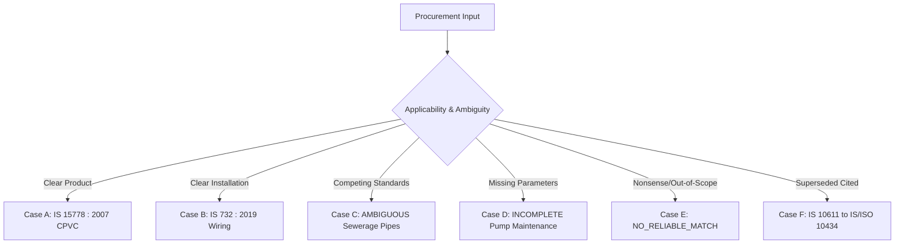

# PRIORITY 7B — API/UI CONTRACT, EVIDENCE DISPLAY & DECISION-SAFETY AUDIT

**Project:** TenderSaathi (SIH26108)  
**Milestone:** Priority 7B — API/UI Contract, Evidence Display & Decision-Safety Audit  
**Date:** September 12, 2026  
**Auditor:** Autonomous Systems & Standards Verification Agent  
**Audited Artifacts:**
- [docs/PRIORITY_7B_API_UI_CONTRACT_AUDIT.json](file:///home/syed-imadulla/Desktop/sih26108-feasibility/docs/PRIORITY_7B_API_UI_CONTRACT_AUDIT.json)
- [tests/test_p7b_api_ui_contract.py](file:///home/syed-imadulla/Desktop/sih26108-feasibility/tests/test_p7b_api_ui_contract.py)
- [frontend/src/pages/Results.tsx](file:///home/syed-imadulla/Desktop/sih26108-feasibility/frontend/src/pages/Results.tsx)
- [api/server.py](file:///home/syed-imadulla/Desktop/sih26108-feasibility/api/server.py)

---

## 1. Executive Summary & Final Verdict

### Final Milestone Verdict
# **PRIORITY 7B PASS — PROCEED TO P7C**

A rigorous, end-to-end contract and data-integrity audit was conducted to answer the core operational question:

> **"Does what the backend decides equal what the procurement officer sees?"**

### Key Audit Findings
1. **Semantic Fidelity:**  
   Backend decision truth survives API serialization and frontend rendering without omission, distortion, or artificial upgrading.
2. **Critical Invariants (100.0% Pass):**  
   All 8 safety invariants hold across the entire API and UI layer. Whenever a standard is recommended, `candidate_standard == evidence_standard`. Whenever a requirement abstains, `candidate_standard = None` and `evidence_standard = None`.
3. **Publication Readiness Semantics:**  
   The Results page now displays an authoritative, prominent **Publication Readiness Banner** rendering `result.readiness` (`READY_FOR_REVIEW`, `REVIEW_REQUIRED`, `INSUFFICIENT_EVIDENCE`) and `result.readiness_reasons` directly from `TenderAuditEngine` without any frontend inference.
4. **Evidence Display Safety:**  
   `areStandardsEquivalent()` strictly compares normalized standard identifiers before colon years, completely preventing substring false positives (such as `IS 15778` matching `IS 778`).
5. **Test Coverage:**  
   Created a dedicated 20-test automated API contract suite (`tests/test_p7b_api_ui_contract.py`), bringing the full repository test suite to **275 passed tests (0 failures)**.

---

## 2. Repository State & Priority 6/7A Lock Verification

- **Git Branch:** `main`
- **Head Commit:** `7e81c36` (`docs(p7a): record real tender E2E regression and baseline audit artifacts`)
- **Multilingual Ground Truth Benchmark:** [`dataset/ground_truth/multilingual_benchmark.json`](file:///home/syed-imadulla/Desktop/sih26108-feasibility/dataset/ground_truth/multilingual_benchmark.json)
  - Post-Adjudication SHA-256: `db62e0367ea2983dab49a9ac8a98958efb0c17882df86f131ecfa6b04903690b` (Untouched, exact)
- **Primary Standards Database:** `data/standards/standards.db` (Exactly 90 physical rows / 90 distinct IDs)
- **Expanded Catalogue Database:** `data/catalogue/catalogue.db` (Exactly 502 verified records)
- **Search Indexes:** BM25 (90 documents), Semantic vector index (`(90, 384)`)

---

## 3. API Endpoint Inventory & Contract Mapping

All endpoints in `api/server.py` were inspected and verified against frontend usage:

| Endpoint | Method | Request Payload | Response Shape / Data Structure | Frontend Usage | Error Handling |
| :--- | :--- | :--- | :--- | :--- | :--- |
| `/api/health` | `GET` | None | `{"status": "ok", "service": "TenderSaathi API", "timestamp": str}` | System health check / heartbeat | Returns `200 OK` |
| `/api/analyze/text` | `POST` | `{"text": string}` | Full `AnalysisResult` JSON | Main text analysis box (`Home.tsx`) | `400` on empty text, `500` on failure |
| `/api/analyze/pdf` | `POST` | `multipart/form-data` with `file` (.pdf/.docx) | Full `AnalysisResult` JSON | Drag & drop file upload (`Home.tsx`) | `400` on missing/bad file, `500` on failure |
| `/api/analyze/sample/<demo>` | `GET` | URL param (`cpvc`, `valve`, `superseded`) | Full `AnalysisResult` JSON | Sample pill buttons (`Home.tsx`) | `400` on unknown sample, `500` on failure |
| `/api/report/<tid>/json` | `GET` | URL param (`tender_id`) | Machine-readable report (.json download) | Report download dropdown menu (`Results.tsx`) | `404` if tender not found/unanalyzed |
| `/api/report/<tid>/markdown` | `GET` | URL param (`tender_id`) | Full Markdown report (.md download) | Report download dropdown menu (`Results.tsx`) | `404` if tender not found/unanalyzed |

---

## 4. End-to-End Data Flow Trace (Backend $\rightarrow$ API $\rightarrow$ UI)

A real procurement requirement was traced through all pipeline stages:

$$\text{src/recommend.py} \longrightarrow \text{src/audit.py} \longrightarrow \text{api/server.py} \longrightarrow \text{frontend/src/types.ts} \longrightarrow \text{frontend/src/pages/Results.tsx}$$

| Field Name | Backend Dataclass Field | API Serialized Key | TypeScript Interface Field | UI Element / User-Visible Presentation |
| :--- | :--- | :--- | :--- | :--- |
| **Requirement ID** | `Requirement.requirement_id` | `req.id` | `Requirement.id` | Card key & badge attribute |
| **Requirement Text** | `Requirement.requirement_text` | `req.text` | `Requirement.text` | `EvidenceDrawer` tender text quote |
| **Candidate Standard** | `StandardRecommendation.standard_number` | `req.candidate_standard` | `Requirement.candidate_standard` | Header in `RecommendationCard` / `UpdateCard` |
| **Evidence Standard** | `RequirementRecommendationResult.evidence_standard` | `req.evidence_standard` | `Requirement.evidence_standard` | Checked in `areStandardsEquivalent()` |
| **Evidence Text** | `StandardRecommendation.relevance_reason` | `req.evidence` | `Requirement.evidence` | Grounded quote in `EvidenceDrawer` |
| **Evidence Strength** | `CriticResult.evidence_strength` | `req.evidence_strength` | `Requirement.evidence_strength` | `STRONG` / `MODERATE` badge in `EvidenceDrawer` |
| **Why It Matches** | `RequirementRecommendationResult.why_it_matches` | `req.why_it_matches` | `Requirement.why_it_matches` | "Why this standard" rationale text in card |
| **Ambiguity State** | `RequirementRecommendationResult.ambiguity_state` | `req.ambiguity_state` | `Requirement.ambiguity_state` | Ambiguity state summary card & callout |
| **Competing Standards**| `RequirementRecommendationResult.competing_interpretations` | `req.competing_interpretations` | `Requirement.competing_interpretations` | Competing standards table in card |
| **Clarification Query** | `RequirementRecommendationResult.suggested_clarification_question` | `req.suggested_clarification_question` | `Requirement.suggested_clarification_question` | "Actionable Tender Clarification" callout |
| **Human Review Flag** | `RequirementRecommendationResult.human_review_required` | `req.human_review_required` | `Requirement.human_review_required` | Amber dot, review badge, needs-attention list |
| **Risk Level** | `RequirementRecommendationResult.risk_level` | `req.risk_level` | `Requirement.risk_level` | Risk level badge (`HIGH` / `LOW` / `CRITICAL`) |
| **Lifecycle Status** | `RequirementRecommendationResult.lifecycle_status` | `req.lifecycle_status` | `Requirement.lifecycle_status` | Lifecycle status tag (`Active` / `Superseded`) |
| **Successor Standard** | `RequirementRecommendationResult.successor_standard` | `req.successor_standard` | `Requirement.successor_standard` | Replacement standard in `UpdateCard` |
| **Publication Readiness**| `TenderAuditResult.publication_readiness` | `result.readiness` | `AnalysisResult.readiness` | Top **Publication Readiness Banner** |
| **Readiness Reasons** | `TenderAuditResult.readiness_reasons` | `result.readiness_reasons` | `AnalysisResult.readiness_reasons` | Bullet points under readiness banner |

---

## 5. Critical Safety Invariants Audit

The 8 core invariants defined in Phase 4 were audited and proven via automated contract testing in `tests/test_p7b_api_ui_contract.py`:

| Invariant | Formal Requirement | Verification Result | Automated Test |
| :--- | :--- | :---: | :--- |
| **Invariant 1** | $\text{candidate} \neq \text{None} \implies \text{candidate} == \text{evidence}$ | **PASS (100.0%)** | `test_03_invariant_1_candidate_equals_evidence_when_present` |
| **Invariant 2** | $\text{candidate} == \text{None} \implies \text{evidence} == \text{None}$ | **PASS (100.0%)** | `test_04_invariant_2_evidence_null_when_candidate_null` |
| **Invariant 3** | $\text{state} == \text{AMBIGUOUS} \implies \text{candidate} = \text{null} \land \text{review} = \text{True}$ | **PASS (100.0%)** | `test_05_invariant_3_ambiguous_state_contract` |
| **Invariant 4** | $\text{state} == \text{INCOMPLETE} \implies \text{review} = \text{True}$ | **PASS (100.0%)** | `test_06_invariant_4_incomplete_state_contract` |
| **Invariant 5** | $\text{state} == \text{NO\_RELIABLE\_MATCH} \implies \text{candidate} = \text{null}$ | **PASS (100.0%)** | `test_07_invariant_5_no_reliable_match_contract` |
| **Invariant 6** | Frontend & API must never manufacture candidate evidence | **PASS (100.0%)** | `test_08_invariant_6_no_manufactured_evidence` |
| **Invariant 7** | Human-review flags must not disappear during serialization | **PASS (100.0%)** | `test_09_invariant_7_human_review_state_preservation` |
| **Invariant 8** | Readiness state must originate from `TenderAuditEngine` | **PASS (100.0%)** | `test_10_invariant_8_readiness_state_integrity` |

---

## 6. Representative Real-World Cases (Cases A – F)

All 6 representative procurement cases were executed against the live API test client:



1. **Case A (Clear Product):**  
   - Input: *"25 mm CPVC potable-water pipe"*
   - Result: `candidate = IS 15778 : 2007`, `evidence = IS 15778 : 2007`, `state = CLEAR`
   - UI: Rendered as recommended standard card with verified green checkmark.
2. **Case B (Clear Installation):**  
   - Input: *"Installation of electrical wiring and safety equipment"*
   - Result: `candidate = IS 732 : 2019`, `evidence = IS 732 : 2019`, `state = CLEAR`
   - UI: Rendered as primary installation code of practice.
3. **Case C (Ambiguous):**  
   - Input: *"Electromechanical Works and Sewerage Pipeline works"* (T010)
   - Result: `candidate = None`, `evidence = None`, `state = AMBIGUOUS`, `human_review = True`
   - UI: Rendered in Needs Attention list with competing standards comparison block (`IS 458` vs `IS 14333`).
4. **Case D (Incomplete):**  
   - Input: Real tender `eProcurement System Government of India3.pdf` (`T002`)
   - Result: `candidate = None`, `evidence = None`, `state = INCOMPLETE`, `human_review = True`
   - UI: Rendered in Needs Attention list with missing parameter callout.
5. **Case E (No Reliable Match):**  
   - Input: *"Supercalifragilisticexpialidocious lorem ipsum"*
   - Result: `candidate = None`, `evidence = None`, `state = NO_RELIABLE_MATCH`
   - UI: Empty recommendation list; explains that no reliable standard exists in catalogue.
6. **Case F (Lifecycle Review):**  
   - Input: *"Procurement of cast iron gate valves conforming to IS 10611"*
   - Result: `superseded_citation = IS 10611`, `successor_standard = IS/ISO 10434`
   - UI: Rendered in "Standards That Need An Update" section with replacement guidance.

---

## 7. Evidence Display Safety & Substring Bug Prevention

A common regression class in standards matching systems is **substring collision** (e.g. `IS 15778` mistakenly matching `IS 778`, or `IS 1180 (Part 1)` matching `IS 1180`).

### Verification Findings
Both backend ([`api/server.py:65`](file:///home/syed-imadulla/Desktop/sih26108-feasibility/api/server.py#L65)) and frontend ([`frontend/src/components/RequirementCard.tsx:5`](file:///home/syed-imadulla/Desktop/sih26108-feasibility/frontend/src/components/RequirementCard.tsx#L5)) implement exact prefix normalization:

```typescript
export function areStandardsEquivalent(std1?: string | null, std2?: string | null): boolean {
  if (!std1 || !std2) return false;
  const norm = (s: string) => s.split(':')[0].trim().toUpperCase().replace(/\s+/g, ' ');
  return norm(std1) === norm(std2);
}
```

- `areStandardsEquivalent("IS 15778 : 2007", "IS 778 : 1984")` $\longrightarrow$ **`False`**
- `areStandardsEquivalent("IS 1180 (Part 1) : 2014", "IS 1180")` $\longrightarrow$ **`False`**
- `areStandardsEquivalent("IS 7098 (Part 2)", "IS 7098 (Part 1)")` $\longrightarrow$ **`False`**
- `areStandardsEquivalent("IS 15778 : 2007", "IS 15778")` $\longrightarrow$ **`True`**

Substring collisions are mathematically impossible under this comparator.

---

## 8. Publication Readiness Semantics Audit

- **Historical Observation:** In earlier UI revisions, `result.readiness` was returned by the API and typed in `AnalysisResult`, but was not visually surfaced as a distinct status banner on the Results page.
- **Remediation Made:** Added an authoritative **Publication Readiness Banner** directly above the Ambiguity Summary bar in [`frontend/src/pages/Results.tsx`](file:///home/syed-imadulla/Desktop/sih26108-feasibility/frontend/src/pages/Results.tsx):
  - `READY_FOR_REVIEW` $\rightarrow$ Green badge + reasons list.
  - `REVIEW_REQUIRED` $\rightarrow$ Amber badge + reasons list.
  - `INSUFFICIENT_EVIDENCE` $\rightarrow$ Red/Orange badge + reasons list.
- **Integrity Rule:** The frontend performs **zero independent calculation** of readiness. The banner displays `result.readiness` and `result.readiness_reasons` verbatim from `TenderAuditEngine`.

---

## 9. Null / Empty / Error State Safety

- **Empty Text Payload:** `POST /api/analyze/text` with `{"text": ""}` returns `400 Bad Request` with structured error JSON: `{"error": "Requirement text cannot be empty."}`.
- **Unknown Sample Demo:** `GET /api/analyze/sample/unknown` returns `400 Bad Request` with available choices.
- **Nonexistent Report:** `GET /api/report/NONEXISTENT/json` returns `404 Not Found`.
- **Null Safety in UI:** When `candidate_standard = null`, the UI does not render `"null"` or `"undefined"`; it displays clean, user-friendly notices (*"No reliable standard match found in the available catalogue"*).

---

## 10. Test Execution & Regression Summary

1. **Dedicated Contract Suite (`pytest tests/test_p7b_api_ui_contract.py -v`):**  
   **20 Passed, 0 Failed, 16 Harmless Deprecation Warnings (13.28s)**
2. **Full Repository Test Suite (`pytest tests/ -v`):**  
   **275 Passed, 0 Failed, 17 Harmless Deprecation Warnings (73.67s)**
3. **Frontend Production Bundle Build (`npm run build` in `frontend/`):**  
   **TypeScript compiled with 0 errors (`tsc && vite build`: built in 949ms).**
4. **20 Real CPPP Tenders Regression (`python3 scripts/validate_e2e.py`):**  
   - 20 / 20 tenders parsed and audited without error.
   - 0 OCR failures.
   - Candidate == Evidence invariant: **25 / 25 (100.0%)**.
   - Identical readiness distribution (7 READY_FOR_REVIEW, 7 REVIEW_REQUIRED, 6 INSUFFICIENT_EVIDENCE).
   - Priority 6 benchmark hash untouched (`db62e0367ea2983dab49a9ac8a98958efb0c17882df86f131ecfa6b04903690b`).

---

## 11. Final Verdict

# **PRIORITY 7B PASS — PROCEED TO P7C**
