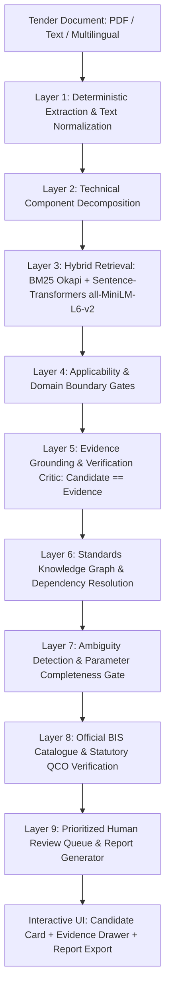
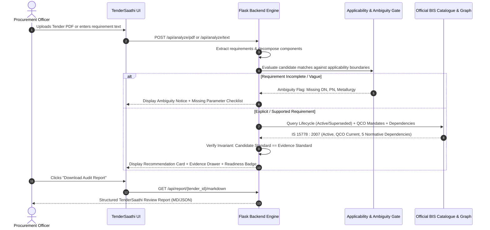

# TenderSaathi (SIH26108) — SIH Pitch Deck & Presentation Reference
**Automated Indian Standards Recommendation & Procurement Review Aid**

---

## Slide 1: Title & Problem Context

- **Project:** TenderSaathi (`SIH26108`)
- **Theme:** Smart Automation in Public Procurement (GeM / CPPP / Defense / Railways / CPWD)
- **Problem Statement:** 
  - Over **₹20 Lakh Crore** in public procurement tenders are published annually across India.
  - Procurement officers frequently encounter **superseded, withdrawn, ambiguous, or incorrect Indian Standards (IS)**, leading to contractor disputes, project delays, and compromised infrastructure.
  - Manual verification of technical requirements across thousands of national standards under tight procurement timelines is prone to oversight.
- **The Solution:** **TenderSaathi** — An evidence-grounded decision-support system that ingests tender documents, extracts technical requirements, matches them against the official BIS catalogue, identifies superseded citations, detects missing engineering parameters, and safely abstains when evidence is insufficient.

---

## Slide 2: 60-Second Elevator Pitch & Trust Model

> *"Every year, government bodies issue tenders specifying outdated or conflicting Indian Standards. When a tender calls for an obsolete 1983 valve standard or vaguely specifies 'submersible pumps' without technical parameters, tenders get challenged in court or suppliers deliver incompatible equipment.*
>
> *TenderSaathi is NOT a black-box LLM chatbot. It is a deterministic, evidence-grounded engineering review aid. In benchmarked warm execution, the engine audits tender requirements in under 1.5 seconds per tender (0.3s to 2.0s per tender, with initial model load ~8.9s), checks validity against the official BIS catalogue, alerts officers if a cited standard is superseded, cross-references verified Quality Control Order (QCO) schedules, and—critically—**abstains rather than guessing** when specifications are incomplete.*
>
> *Our Core USP: **We don't just recommend standards. We audit the tender against the standards it should contain.**
>
> *Our Trust Model: **AI interprets. Rules validate. Evidence supports. Humans decide.***"

---

## Slide 3: Technical Architecture (Layered Defense)

### Layer-by-Layer Function, Rationale, and Failure Protection

| Layer | Component | Core Function | Why It Exists | Failure Protection |
|---|---|---|---|---|
| **1** | PDF / Text Ingestion | Extracts raw tender clauses and multilingual text | Ingests real government tenders across Hindi, Tamil, and English | Normalizes whitespace; handles text-based PDFs directly; scanned PDFs depend on OCR legibility |
| **2** | Technical Decomposition | Splits multi-item procurement into discrete engineering clauses | Prevents cross-item confusion (e.g., pump + motor + starter) | Reverts cleanly to whole-clause fallback if decomposition finds no sub-items |
| **3** | Hybrid Retrieval | Dense Semantic (`all-MiniLM-L6-v2`) + Sparse Lexical (`BM25 Okapi`) | Recalls exact standard numbers and semantic descriptions | Reciprocal Rank Fusion ensures recall across vocabulary differences |
| **4** | Applicability Gates | Deterministic boundary rules (e.g., negative lookahead for non-submersible pumps) | Prevents domain crossover (e.g., surface pump matching IS 8034) | Rejects out-of-scope candidates before ranking |
| **5** | Evidence Grounding | Strict clause-level text verification & score validation | Enforces Candidate == Evidence parity | Drops candidate to `None` and routes to human review if evidence is unsupported |
| **6** | Standards Graph | Graph of Normative References, Test Methods & Allied Standards | Tenders require complete standards ecosystems | Returns core standard safely with empty dependency list if unindexed |
| **7** | Ambiguity Detector | Identifies missing discriminating technical parameters (DN, PN, metallurgy) | Flags vague specifications (e.g., 'valve' without pressure rating) | Assigns `REVIEW_REQUIRED` and generates targeted clarification questions |
| **8** | Catalogue & QCO | Cross-references 502-record official BIS catalogue & QCO schedules | Detects superseded citations and statutory mandates | Emits lifecycle warnings; surfaces active successor standards |
| **9** | Report & Audit | Assigns Publication Readiness (`READY_FOR_REVIEW`, `REVIEW_REQUIRED`, `INSUFFICIENT`) | Provides structured executive summary and actionable review queue | Exports structured Markdown and JSON reports for procurement record-keeping |

---

## Slide 4: Full Ingestion & Audit Workflow

---

## Slide 5: Core Differentiators & Unique Selling Propositions (USPs)

1. **Evidence-Grounded Recommendations vs. Unconstrained LLMs:**
   - General LLMs risk inventing standard numbers or hallucinating outdated citations without verification.
   - TenderSaathi uses a **grounded evidence gate**: A standard is only recommended if supporting text extracts from the standard confirm applicability.
2. **Deterministic Candidate-Evidence Invariant:**
   - Invariant: `candidate_standard == evidence_standard`. If evidence cannot be proven from the official standard, the candidate defaults to `None`. No ungrounded suggestions.
3. **Safe Abstention First:**
   - When given vague or incomplete requirements, typical AI systems guess.
   - TenderSaathi **abstains safely**: Candidate=`None`, Evidence=`None`, Status=`INSUFFICIENT_EVIDENCE`, and generates targeted clarification questions for the procurement engineer.
4. **Lifecycle & Supersedence Tracking:**
   - Identifies when a tender cites an obsolete standard (e.g. `IS 10611 : 1983`) and surfaces the active BIS successor standard (`IS/ISO 10434 : 2020`).
5. **Quality Control Order (QCO) Awareness:**
   - Cross-references statutory QCO schedules published in the Gazette of India where indexed in our catalogue.
6. **Ecosystem & Dependency Graph:**
   - Discovers normative references, test methods, and installation standards to prevent incomplete procurement specifications.

---

## Slide 6: The 3 Primary Live Demo Flows

### Demo 1: Clear Recommendation (Happy Path)
- **Input:** *"Supply and installation of CPVC pipes and fittings for domestic hot and cold water distribution system, conforming to IS 15778."*
- **TenderSaathi Output:**
  - **Candidate Standard:** `IS 15778 : 2007`
  - **Evidence Standard:** `IS 15778 : 2007` (Candidate == Evidence Parity: **True**)
  - **Why It Matches:** Explicit tender requirement verified against BIS Scope extract.
  - **Lifecycle:** `ACTIVE`
  - **Dependencies Discovered:** 5 standards (IS 4985, IS 12235 test series).
  - **Readiness:** `READY_FOR_REVIEW`

### Demo 2: Safe Abstention & Parameter Ambiguity
- **Input (Real Tender T002):** *"Annual Rate Contract for Execution of Mechanical Maintenance Works including Pumps, Valve Replacement at Heavy Water Board Facilities."*
- **TenderSaathi Output:**
  - **Candidate Standard:** `None (Abstained)`
  - **Evidence Standard:** `None`
  - **Why Flagged:** Specification omits critical discriminating parameters (Valve type, nominal size, pressure rating, body metallurgy).
  - **Readiness:** `INSUFFICIENT_EVIDENCE` / `REVIEW_REQUIRED`
  - **Action:** Generates targeted clarification questions for the procurement engineer.

### Demo 3: Superseded Standard & Successor Recommendation
- **Input:** *"Procurement of bolted bonnet steel gate valves conforming to IS 10611 : 1983."*
- **TenderSaathi Output:**
  - **Cited in Tender:** `IS 10611 : 1983`
  - **Lifecycle Advisory:** `SUPERSEDED`
  - **Active Successor Standard:** `IS/ISO 10434 : 2020`
  - **Evidence Standard:** `IS/ISO 10434 : 2020` (Parity: **True**)
  - **Readiness:** `REVIEW_REQUIRED` (Human confirmation of standard transition).

---

## Slide 7: Technical Stack & Verified Repository Metrics

- **Backend:** Python 3.11, Flask, SQLite (WAL mode, foreign keys), PyMuPDF / pdfplumber.
- **Search & Retrieval:** Hybrid Rank Fusion (`BM25 Okapi` + Sentence-Transformers `all-MiniLM-L6-v2` dense embeddings).
- **Frontend:** React 18, TypeScript, Vite, Vanilla CSS (zero-dependency UI, high-contrast accessible design).
- **Verified Repository Evidence:**
  - **Automated Test Suite:** **319 passed / 319 executed** (0 failures, 47 non-blocking datetime deprecation warnings, execution time ~102s).
  - **Real Tender E2E Audit:** **20 real government tender PDFs** processed with zero unhandled exceptions; **5 representative review reports** generated (Clean, Ambiguous, Multi-item, Electromechanical, Superseded).
  - **Multilingual Ground Truth Benchmark:** Frozen SHA-256 (`db62e036...`), 40/40 language detection, 100% candidate-evidence parity.
  - **Standards DB Scope:** Exactly 90 rows (90 distinct standard IDs, 0 duplicates) with deep clause-level evidence.
  - **Catalogue DB Scope:** Exactly 502 verified records from the official BIS standards catalogue.
  - **Frontend Production Build:** Compiles cleanly with zero TypeScript errors in 1.15s (`dist/` verified).

---

## Slide 8: Defensibility — Evidence-Backed Answers to Tough Judge Questions

| Question | Evidence-Backed Answer |
|---|---|
| **"Why not just use ChatGPT or Gemini?"** | LLMs risk generating non-existent standards and cannot provide verifiable, clause-level grounding against official BIS gazette records. TenderSaathi enforces strict candidate-evidence parity: if evidence cannot be proven from standard text, the candidate is dropped to `None`. |
| **"What if your database doesn't have the standard?"** | TenderSaathi safely abstains (`candidate=None, evidence=None`) and routes the requirement to the human review queue with status `INSUFFICIENT_EVIDENCE`. It does not guess. |
| **"How do you handle ambiguous tenders?"** | Our Ambiguity Gate inspects 5 critical engineering dimensions (equipment type, size, pressure rating, metallurgy, medium). If missing, it flags the specification as `REVIEW_REQUIRED` and outputs targeted clarification prompts. |
| **"How does the system scale to all 20,000+ BIS standards?"** | The architecture is designed to scale to a much larger catalogue. The current verified catalogue contains 502 records, with deep clause-level evidence populated for 90 core standards. Expanding to full 20,000+ BIS coverage requires ongoing document ingestion into our SQLite + BM25 + vector pipeline without architectural redesign. |
| **"Can it process scanned PDFs?"** | The pipeline processes digital text-based PDFs directly. For scanned or low-resolution documents, processing depends on external OCR legibility; unreadable text is safely flagged for manual review. |
| **"Does TenderSaathi replace procurement officers?"** | No. TenderSaathi is explicitly designed as a *standards-review aid* and decision-support tool. It organizes findings into a Prioritized Human Review Queue, augmenting engineering review without replacing human responsibility. |
| **"Can reports be used in legal procurement records?"** | TenderSaathi reports provide structured, timestamped evidence for procurement review and record-keeping, but do not constitute legal compliance certification. |

---

## Slide 9: National Impact & Future Roadmap

- **Government e-Marketplace (GeM) & CPPP Integration:** Pre-publication screening microservice to assist officers before tender floating.
- **Litigation & Dispute Mitigation:** Highlights ambiguous specifications and superseded standards early, reducing post-award claims.
- **Statutory QCO Awareness:** Helps procurement officers verify whether mandatory Quality Control Orders apply to tendered items.
- **Roadmap:** Ongoing catalogue ingestion to expand from 502 catalogue records to wider national standards coverage.

---

## Slide 10: Explicit Limitations & Presentation Boundaries

1. **Catalogue Coverage:** Deep clause-level verification is currently populated for 90 core electromechanical, civil, and piping standards; catalogue metadata covers 502 official BIS records. Full 20,000+ BIS coverage is a future ingestion effort.
2. **Human Decision-Making Required:** TenderSaathi is a review aid. Ambiguous, unsupported, or superseded cases are explicitly routed to technical officers for final determination.
3. **Scanned Documents:** Performance on scanned documents depends on scan resolution and OCR quality.
4. **Regulatory Scope:** QCO verification covers sectors currently indexed in the regulatory database; unindexed sectors require officer verification.
5. **No Legal Certification:** TenderSaathi outputs are technical decision-support reports, not formal legal compliance certificates.
