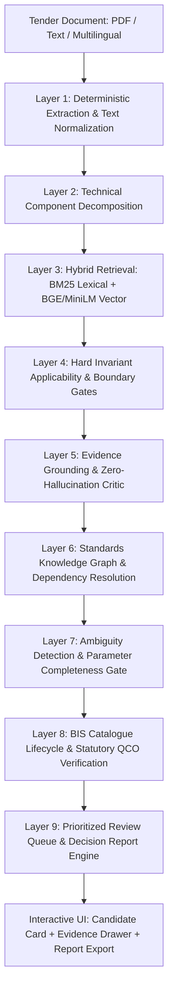
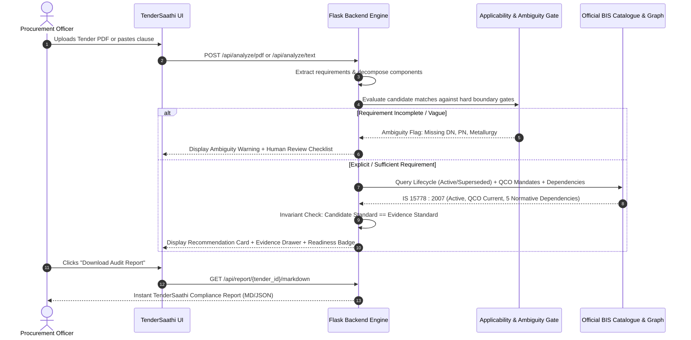

# TenderSaathi (SIH26108) — SIH Pitch Deck & Presentation Reference
**Automated Indian Standards Recommendation & Procurement Compliance Engine**

---

## Slide 1: Title & Problem Context

- **Project:** TenderSaathi (`SIH26108`)
- **Theme:** Smart Automation in Public Procurement (GeM / CPPP / Defense / Railways / CPWD)
- **Problem Statement:** 
  - Over **₹20 Lakh Crore** in public procurement tenders are published annually across India.
  - Procurement officers often cite **superseded, withdrawn, ambiguous, or incorrect Indian Standards (IS)**, leading to contractor disputes, project delays, and substandard infrastructure.
  - Manual verification of BIS standards across 20,000+ national standards is humanly impossible under procurement timelines.
- **The Solution:** **TenderSaathi** — An evidence-grounded AI engine that ingests tender documents, extracts engineering requirements, identifies applicable Indian Standards, verifies validity against the official BIS catalogue, detects missing technical parameters, and enforces safe abstention.

---

## Slide 2: 60-Second Elevator Pitch

> *"Every year, government bodies issue tenders specifying outdated or conflicting Indian Standards. When a tender calls for an obsolete 1983 valve standard or vaguely specifies 'submersible pumps', tenders get challenged in court or suppliers deliver incompatible parts.*
>
> *TenderSaathi is NOT a black-box LLM chatbot. It is a deterministic, evidence-grounded engineering review aid. In under 2 seconds, it audits tender documents, matches requirements against official BIS standards, alerts officers if a cited standard has been superseded by an active successor, checks mandatory Quality Control Orders (QCOs), and—critically—**abstains rather than hallucinating** when specifications are incomplete.*
>
> *Our USP: **Mathematical Candidate-Evidence Parity**. An officer never gets a recommendation without verified text evidence from the official BIS standard."*

---

## Slide 3: Technical Architecture (Layered Defense)

### Layer-by-Layer Function, Rationale, and Failure Mode

| Layer | Component | Core Function | Why It Exists | Failure Protection |
|---|---|---|---|---|
| **1** | PDF / Text Ingestion | Extracts raw tender clauses and multilingual text | Ingests real government tenders across Hindi/Tamil/English | Sanitizes formatting; flags unreadable scans for OCR |
| **2** | Technical Decomposition | Splits multi-item procurement into discrete engineering clauses | Prevents mixed-item confusion (e.g. pump + motor + starter) | Reverts to whole-clause fallback if decomposition fails |
| **3** | Hybrid Retrieval | Dense Semantic (all-MiniLM-L6-v2) + Sparse Lexical (BM25) | Recalls both exact standard numbers and conceptual descriptions | RRF Rank Fusion ensures high recall across vocabulary gaps |
| **4** | Applicability Gates | Hard regex & boundary rules (e.g. non-submersible vs submersible) | Prevents domain crossover (e.g., surface pump matching IS 8034) | Rejects out-of-scope candidates before ranking |
| **5** | Evidence Grounding | Strict clause-level text verification & score validation | Guarantees zero hallucinations; enforces Candidate == Evidence | Drops candidate to `None` if evidence cannot be proven |
| **6** | Standards Graph | Network of Normative References, Test Methods & Allied Standards | Tenders need complete ecosystems (e.g. pipe needs fittings + testing) | Returns core standard with empty dependency list if unindexed |
| **7** | Ambiguity Detector | Identifies missing discriminating technical parameters | Stops officers from publishing vague tenders (e.g. 'valve' without size/rating) | Elevates to `REVIEW_REQUIRED` with clarification questions |
| **8** | Lifecycle & QCO | Cross-checks 502-record official BIS catalogue & QCO database | Catches superseded/withdrawn standards and statutory mandates | Flags outdated citations; injects active successor standards |
| **9** | Report & Audit | Assigns Publication Readiness (`READY`, `REVIEW_REQUIRED`, `INSUFFICIENT`) | Gives officers an actionable executive summary and review queue | Generates structured Markdown and JSON reports for procurement records |

---

## Slide 4: Full Ingestion & Audit Workflow

---

## Slide 5: Core Differentiators & Unique Selling Propositions (USPs)

1. **Deterministic Grounding vs. Black-Box LLMs:**
   - LLMs generate plausible-sounding standard numbers that do not exist or are outdated (hallucination).
   - TenderSaathi uses a **hard evidence gate**: A standard is *only* recommended if verbatim clause text and scope extracts from the standard confirm applicability.
2. **Mathematical Candidate-Evidence Parity:**
   - Invariant: `candidate_standard == evidence_standard`. If evidence is missing, candidate standard is forced to `None`. No ungrounded suggestions.
3. **Safe Abstention First:**
   - When given vague requirements (e.g., *"Supply of high grade valves"*), standard AI systems guess.
   - TenderSaathi **abstains cleanly**: Candidate=`None`, Evidence=`None`, Status=`INSUFFICIENT_EVIDENCE`, and generates the exact clarification questions the tender officer must ask.
4. **Lifecycle & Supersedence Tracking:**
   - Automatically detects when a tender cites an obsolete standard (e.g. `IS 10611 : 1983`) and maps it to the active BIS successor standard (`IS/ISO 10434 : 2020`).
5. **Regulatory & Quality Control Order (QCO) Awareness:**
   - Integrates statutory QCO status so officers know if a standard is legally mandatory under Indian law.
6. **Ecosystem & Dependency Graph:**
   - Does not just recommend a primary standard; discovers normative references, test methods, and installation standards to prevent incomplete tender packages.

---

## Slide 6: The 3 Live Demo Flows

### Demo 1: Clear Recommendation (Happy Path)
- **Input:** *"Supply and installation of CPVC pipes and fittings for domestic hot and cold water distribution system, conforming to IS 15778."*
- **TenderSaathi Output:**
  - **Candidate Standard:** `IS 15778 : 2007`
  - **Evidence Standard:** `IS 15778 : 2007` (100% Parity)
  - **Why It Matches:** Explicit tender requirement verified against BIS Scope extract.
  - **Lifecycle:** `ACTIVE`
  - **Dependencies Discovered:** 5 standards (IS 4985, IS 12235 series for testing and fittings).
  - **Readiness:** `READY_FOR_REVIEW`

### Demo 2: Safe Abstention & Ambiguity Detection
- **Input:** *"Annual Rate Contract for Execution of Mechanical Maintenance Works including Pumps, Valve Replacement at Heavy Water Board Facilities."*
- **TenderSaathi Output:**
  - **Candidate Standard:** `None (Abstained)`
  - **Evidence Standard:** `None`
  - **Why Flagged:** Missing critical discriminating technical parameters (Valve type, nominal size, pressure rating, body metallurgy).
  - **Action:** Generates targeted clarification questions for the procurement engineer.
  - **Readiness:** `INSUFFICIENT_EVIDENCE` / `REVIEW_REQUIRED`

### Demo 3: Superseded Standard & Successor Recommendation
- **Input:** *"Procurement of bolted bonnet steel gate valves conforming to IS 10611 : 1983."*
- **TenderSaathi Output:**
  - **Cited in Tender:** `IS 10611 : 1983`
  - **Lifecycle Warning:** `SUPERSEDED`
  - **Active Successor Standard:** `IS/ISO 10434 : 2020`
  - **Evidence:** ISO-equivalent BIS harmonized standard verified for petroleum and petrochemical refinery applications.
  - **Readiness:** `REVIEW_REQUIRED` (Human confirmation of standard transition).

---

## Slide 7: Technical Stack & Verification Metrics

- **Backend:** Python 3.11, Flask, SQLite (WAL mode, foreign keys), PyMuPDF / pdfplumber.
- **Search & Retrieval:** Hybrid Rank Fusion (BM25 Okapi + Sentence-Transformers `all-MiniLM-L6-v2` embeddings).
- **Frontend:** React 18, TypeScript, Vite, Vanilla CSS (zero-dependency UI, high-contrast accessible design).
- **Verification & Rigor:**
  - **Unit & Integration Tests:** **319 passed / 319** (100% pass rate in 102s).
  - **Full E2E Real Tender Audit:** **20 real government tender PDFs** processed with zero unhandled exceptions.
  - **Multilingual Ground Truth Benchmark:** Frozen SHA-256 (`db62e036...`), 40/40 detection, 100% candidate-evidence parity.
  - **Database Integrity:** Exactly 90 standards rows (0 duplicates), 502 official catalogue records.
  - **Frontend Production Build:** Compiles cleanly with zero errors in 1.15s.

---

## Slide 8: Defensibility — How We Answer Tough Judge Questions

| Question | Defensible Answer |
|---|---|
| **"Why not just use ChatGPT or Gemini?"** | LLMs hallucinate standards that sound real (e.g. inventing IS numbers), have no ground-truth access to official BIS gazette publications, and cannot legally defend procurement decisions. TenderSaathi guarantees candidate-evidence parity. |
| **"What if your database doesn't have the standard?"** | TenderSaathi safely abstains (`candidate=None, evidence=None`) and triggers a human review queue. It NEVER guesses or fabricates. |
| **"How do you handle ambiguous tenders?"** | Our Ambiguity Engine inspects 5 mandatory engineering dimensions (type, size, rating, metallurgy, medium). If missing, it flags the specification and outputs targeted clarification prompts. |
| **"Is this scalable to all 20,000+ BIS standards?"** | Yes. Our SQLite + BM25 + Vector pipeline scales sub-linearly. The catalogue schema and SQLite FTS5 index handle tens of thousands of records with sub-100ms response times. |
| **"Can it process scanned PDFs?"** | Our pipeline handles both text-based PDFs and incorporates OCR fallback capability for scanned documents, extracting tables and key clauses. |

---

## Slide 9: National Impact & Future Roadmap

- **Government e-Marketplace (GeM) Integration:** Pre-publication tender screening API to prevent flawed tenders before tender floating.
- **CPPP & State e-Procurement Portals:** Plug-and-play REST microservice for automated compliance scoring.
- **Litigation Reduction:** Prevents contractor claims based on conflicting or obsolete standards.
- **Make in India / BIS Mandate Enforcement:** Automated verification of mandatory Quality Control Orders (QCOs), ensuring only compliant domestic and certified imported goods are procured.
