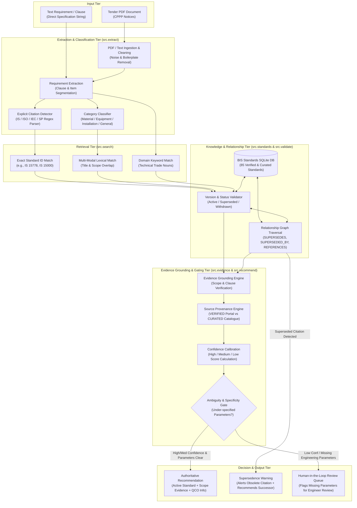

# System Architecture: SIH26108 Recommendation Engine

**Problem Statement**: SIH26108 — *“AI-Powered Recommendation Engine for Identifying Applicable Indian Standards for Procurement Specifications”*  
**Document**: PPT-Ready Architecture Blueprint & Component Walkthrough  
**Phase**: Milestone 2 Prototype Architecture

---

## 1. End-to-End Workflow Architecture Diagram

---

## 2. Component Walkthrough & Responsibilities

### Tier 1: Input Ingestion Tier
* **Supported Inputs**: Accepts either multi-page raw tender notice PDFs from Central Government procurement portals (`tenders/raw/` or `data/tenders/`) or arbitrary plain-text specification strings from procurement officers.
* **Boilerplate Stripping**: Systematically discards administrative noise (EMD details, multi-currency bidding rules, tender fees, critical submission dates) to focus strictly on technical work descriptions.

### Tier 2: Requirement Extraction & Classification (`src/extract.py`)
* **Clause Segmentation**: Isolates discrete procurement requirements from multi-item tender summaries.
* **Category Classification**: Classifies each statement into one of four standardized engineering categories:
  - `material`: Raw construction materials, tiles, pipes, chemicals, cables.
  - `product_equipment`: Discrete manufactured machines, valves, pumps, transformers, panels.
  - `installation_execution`: Civil works, laying of concrete pipes, earthing installation, rewiring.
  - `general_specification`: Codes of practice, hygiene guidelines (HACCP), national safety codes.
* **Explicit Citation Detection**: Scans for existing Indian Standard mentions (`IS 1239`, `SP 30`, `IS/IEC 61439`) to verify if the tender cites current or obsolete standards.

### Tier 3: Multi-Modal Standards Retrieval (`src/search.py`)
* **Exact Number Search**: Sub-millisecond lookup on standard numbers and divisional identifiers.
* **Lexical & Semantic Overlap**: BM25-inspired token overlap matching against standard titles and scope clauses, filtered through technical stop-word lists.
* **Domain Keyword Boosting**: High-weight scoring for distinctive technical engineering nouns (e.g. *CPVC*, *hubless*, *sluice*, *precast concrete*, *VFD*, *earthing*).

### Tier 4: Knowledge Graph & Status Validation (`src/standards.py`, `src/validate.py`)
* **Unified SQLite Repository**: Stores normalized metadata, technical committee designations, reaffirmation dates, and verbatim scopes.
* **Explicit Relationship Graph**: Stores directional edges strictly backed by evidence:
  - `SUPERSEDES`: Connects active standards to obsolete standards (e.g. `IS/ISO 10434` $\rightarrow$ `IS 10611`).
  - `REFERENCES`: Connects citing standards to normative references (e.g. `IS 15000` $\rightarrow$ `IS 2491`).
  - `CODE_OF_PRACTICE_FOR`: Connects execution guidelines to product specifications (e.g. `IS 783` $\rightarrow$ `IS 458`).
* **Active Status Checking**: Distinguishes `CURRENT_ACTIVE`, `REPLACED_OR_SUPERSEDED`, and `WITHDRAWN` states.

### Tier 5: Evidence Grounding & Confidence Calibration (`src/evidence.py`, `src/recommend.py`)
* **Evidence Grounding**: Factual claims are mapped directly to verbatim clauses in the Scope or Foreword. If unsupported, the engine yields *"Insufficient evidence"* rather than fabricating technical data.
* **Provenance Tracking**: Maintains full source attribution (`VERIFIED: BSB Edge Portal` vs `CURATED: BIS Catalogue`).
* **Confidence Scoring**: Calibrates confidence as `High` (exact standard / high scope match on active standard), `Medium` (curated standard or partial match), or `Low` (ambiguous scope).

### Tier 6: Decision & Human-in-the-Loop Gate
* **Authoritative Recommendations**: Generates clear, actionable recommendation cards showing standard number, title, active status, scope snippet, and DPIIT Quality Control Order (QCO) mandatory status.
* **Supersedence Alerts**: Alerts procurement officers when their tender cites a superseded standard and suggests the valid legal successor.
* **Ambiguity Routing**: Automatically identifies under-specified tenders (missing pipe diameters, pressure ratings, or fluid media) and routes them to human engineers, preventing procurement disputes.
