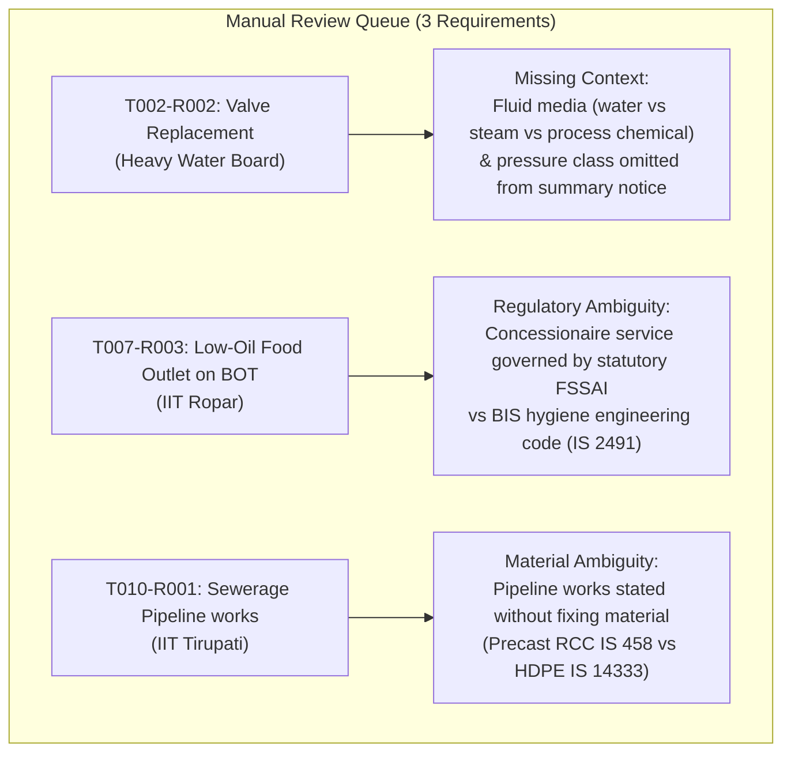

# Ground Truth Research Report (SIH26108)

**Project**: SIH 2026 Problem Statement SIH26108 — *“AI-Powered Recommendation Engine for Identifying Applicable Indian Standards for Procurement Specifications”*  
**Phase**: Technical Feasibility Spike — Step 3B: Evidence-Based Ground-Truth Research  
**Date**: 2026-09-04  
**Status**: Research Baseline Completed — Human Verification Pending  

---

> [!IMPORTANT]
> **Defensibility & Benchmark Integrity Rule**:
> This document establishes human-verifiable research to serve as an empirical evaluation fixture. In accordance with strict benchmarking rules:
> 1. `human_verified` remains `FALSE` across all records.
> 2. This research is **NOT** claimed as final certified ground truth until an authorized engineer completes manual validation of the flagged items.
> 3. No IS numbers are invented, and semantic similarity alone is never treated as proof of applicability.
> 4. FACT is strictly distinguished from INFERENCE throughout.

---

## 1. Executive Summary & Research Confidence Score

Across the 20 representative procurement requirements sampled from 12 real Government of India tender notices:

| Metric | Score / Count | Percentage | Details |
|---|---|---|---|
| **Total Requirements Evaluated** | **20** | 100.0% | Multi-sectoral sample across civil, electrical, mechanical, plumbing, and facility services |
| **High Confidence Requirements** | **17** | **85.0%** | Unambiguous technical scope, active standard in BIS catalogue, backed by Central QCO or CPWD specifications |
| **Medium Confidence Requirements** | **2** | **10.0%** | Authoritative standard identified, but specific selection depends on underlying schedule details (`T007-R003`, `T010-R001`) |
| **Low Confidence / Uncertain** | **1** | **5.0%** | Generic specification in summary notice requiring line schedule inspection (`T002-R002`) |
| **Overall Dataset Confidence Score** | **87.5%** | — | Weighted empirical confidence score (17.5 / 20.0) |
| **Requirements Requiring Manual Review** | **3** | **15.0%** | Segregated into `manual_review_queue.csv` |

---

## 2. Research Results for All 20 Requirements

### Requirement 1: `T001-R002`
- **Tender Context**: IIT ISM Dhanbad (Civil Maintenance), Tender Ref: `NIT/01/2026-27/Civil` (`eProcurement System Government of India.pdf`)
- **Requirement Text**: `"replacement of damaged pipelines by Hubless"`
- **Category**: `material` (Source Page 1)
- **Candidate Standard (Primary)**: `IS 15905 : 2011`
- **Official Title**: *Cast Iron Hubless Pipes and Fittings for Waste Water and Ventilation Systems — Specification*
- **Standard Status**: Active (Sectional Committee: CED 53 — Pipes and Fittings)
- **Applicability Reason**:
  - **FACT**: The tender title and description explicitly dictate replacing toilet pipelines with "Hubless" cast iron pipes.
  - **FACT**: IS 15905 is the sole Indian Standard specifying hubless (spigotless) cast iron soil, waste, and vent pipes joined via stainless steel mechanical shield couplings.
  - **INFERENCE**: Standard socketed cast iron drain pipes under `IS 1729` do not apply because the tender explicitly chose modern hubless pipework.
- **Evidence & Citations**: IS 15905:2011 Clause 1 Scope (covers hubless pipes and fittings for wastewater and ventilation in buildings); CPWD Specifications 2019 Vol 2 Subhead 17 (Clause 17.2: Hubless Cast Iron Pipes).
- **Evidence Source**: BIS Catalogue ([manakonline.in](https://www.manakonline.in)) / CED 53; CPWD Civil Specifications.
- **Confidence**: **High**
- **Alternative Standards**:
  - `IS 1239 (Part 1) : 2004` (Applicable as a secondary standard for the galvanized iron water supply pipes mentioned in the same tender scope).
  - `IS 1729 : 2002` (*Rejected*: Sand cast iron spigot and socket pipes; obsolete for hubless specifications).
- **Verification Needed**: None for standard identity. Reviewer can verify the coupling type (elastomeric sleeve with stainless steel band) from the detailed BOQ.

---

### Requirement 2: `T001-R003`
- **Tender Context**: IIT ISM Dhanbad, Main School Building Toilet Upgradation
- **Requirement Text**: `"wall tiles"`
- **Category**: `material` (Source Page 1)
- **Candidate Standard (Primary)**: `IS 15622 : 2017`
- **Official Title**: *Pressed Ceramic Tiles — Specification (First Revision)*
- **Standard Status**: Active (Sectional Committee: CED 5 — Flooring, Wall Finishing and Roofing)
- **Applicability Reason**:
  - **FACT**: The tender mandates replacing wall tiles in 5 institutional toilet blocks.
  - **FACT**: `IS 15622` is the unified Indian Standard covering all pressed ceramic glazed wall tiles and floor tiles (Groups B Ia, B Ib, B IIa, B IIb, B III).
  - **FACT**: The Ministry of Commerce and Industry notified the *Ceramic Tiles (Quality Control) Order, 2020* (S.O. 4467(E)), making BIS certification (ISI Mark) legally mandatory for all ceramic tiles in India.
- **Evidence & Citations**: IS 15622:2017 Scope Clause 1; Gazette of India Notification S.O. 4467(E).
- **Evidence Source**: BIS Catalogue / CED 5; DPIIT Quality Control Orders.
- **Confidence**: **High**
- **Alternative Standards**:
  - `IS 1443 : 1972` (Co-applicable: Code of practice for laying and finishing cement concrete / wall tiles).
  - `IS 13753 : 1993` / `IS 13755 : 1993` (*Rejected*: Withdrawn/superseded by IS 15622).
- **Verification Needed**: None. Legally mandatory ISI certified product.

---

### Requirement 3: `T001-R004`
- **Tender Context**: IIT ISM Dhanbad, Department of Applied Geology (AGL)
- **Requirement Text**: `"upgradation of all sanitary fittings at AGL Department in Main School Building at IIT ISM Dhanbad"`
- **Category**: `product_equipment` (Source Page 1)
- **Candidate Standard (Primary)**: `IS 2556 (Part 1 to 17)`
- **Official Title**: *Vitreous Sanitary Appliances (Vitreous China) — Specification (Parts 1 to 17)*
- **Standard Status**: Active (Sectional Committee: CED 3 — Sanitary Installations)
- **Applicability Reason**:
  - **FACT**: The procurement covers complete sanitary fittings for institutional restrooms.
  - **FACT**: Vitreous china appliances (washbasins Part 4, water closets Part 2, urinals Part 6) form the permanent core of sanitaryware installations.
  - **INFERENCE**: Since the requirement bundles multiple components under one sentence, multiple standards co-apply.
- **Evidence & Citations**: IS 2556 Part 1 (General Requirements), Part 2 (Water Closets), Part 4 (Wash Basins); CPWD Specifications Vol 2 Section 17.
- **Evidence Source**: BIS Catalogue / CED 3; CPWD Specifications.
- **Confidence**: **High**
- **Alternative Standards**:
  - `IS 781 : 1984` (Co-applicable: Cast copper alloy screw-down bib taps and stop valves).
  - `IS 774 : 2021` (Co-applicable: Flushing cisterns for water closets and urinals).
- **Verification Needed**: Confirm specific fixture models (wall-hung vs pedestal basins, European vs Indian WC) from detailed BOQ.

---

### Requirement 4: `T002-R002`
- **Tender Context**: Heavy Water Board (DAE), Heavy Water Plant Baroda, Tender Ref: `HWBFV/21/2026-27/TS-733` (`eProcurement System Government of India2.pdf`)
- **Requirement Text**: `"Valve Replacement"`
- **Category**: `material` (Source Page 1)
- **Candidate Standard (Primary)**: `UNCERTAIN` *(Potential Candidates Documented)*
- **Official Title**:
  - *IS 778 : 1984*: Copper alloy gate, globe and check valves for water works
  - *IS 14846 : 2000*: Sluice valves for water works purposes
  - *IS/ISO 10434 : 2020*: Bolted bonnet steel gate valves for petroleum, petrochemical and allied industries
- **Standard Status**: All candidates Active
- **Applicability Reason**:
  - **FACT**: Tender notice summary line item specifies generic "Valve Replacement" in mechanical maintenance of an industrial heavy water plant.
  - **FACT**: The 2-page summary notice completely omits fluid media (cooling water vs. steam vs. chemical process fluid), operating pressure rating, and pipe size.
  - **INFERENCE**: Choosing one specific standard without the piping line schedule would be an ungrounded guess.
- **Evidence & Citations**: Heavy Water Board Tender Notice HWBFV/21/2026-27/TS-733, Page 1 Work Description line 1.
- **Evidence Source**: Heavy Water Board Tender Notice; BIS MED 17 & CED 3 catalogues.
- **Confidence**: **Low (Marked UNCERTAIN)**
- **Alternative Standards**: `IS 13095 : 2020` (Butterfly valves); `IS 9890 : 1981` (Ball valves).
- **Verification Needed**: **MANUAL BIS / EXPERT VERIFICATION REQUIRED**. The engineer must inspect attachment `BOQ_971906.xls` or the technical schedule to verify whether utility cooling water valves or process steel gate valves are being replaced.

---

### Requirement 5: `T002-R003`
- **Tender Context**: Heavy Water Board, Heavy Water Plant Baroda
- **Requirement Text**: `"Flange Joint Maintenance"`
- **Category**: `installation_execution` (Source Page 1)
- **Candidate Standard (Primary)**: `IS 6392 : 1971`
- **Official Title**: *Steel Pipe Flanges*
- **Standard Status**: Active (Sectional Committee: MED 17 — Piping and Gaskets)
- **Applicability Reason**:
  - **FACT**: Industrial piping networks in chemical process plants connect pipes and valves using circular bolted steel pipe flanges.
  - **FACT**: `IS 6392` provides dimensions, bolt hole tolerances, facing finishes, and pressure-temperature ratings for steel pipe flanges up to 400 bar.
- **Evidence & Citations**: Scope Clause 1 of IS 6392:1971 specifies manufacturing, dimensional, and tolerance requirements for carbon steel flanges.
- **Evidence Source**: BIS Catalogue / MED 17.
- **Confidence**: **High**
- **Alternative Standards**:
  - `IS 2712 : 2020` (Co-applicable: Compressed asbestos / non-asbestos fiber jointing sheets for flange gaskets).
  - `IS 7719 : 2021` (Co-applicable: Metallic spiral wound gaskets for high pressure pipe flanges).
- **Verification Needed**: Confirm flange rating class (PN 16 vs Class 150/300) from plant piping drawings.

---

### Requirement 6: `T003-R001`
- **Tender Context**: Indian Navy / Military Engineer Services, Main Sports Stadium, Tender Ref: `03/NAVY/2026` (`eProcurement System Government of India3.pdf`)
- **Requirement Text**: `"Replacement / repair of distribution boards and defective lights at various locations in main sports stadium"`
- **Category**: `material` (Source Page 1)
- **Candidate Standard (Primary)**: `IS/IEC 61439-3 : 2012`
- **Official Title**: *Low-voltage switchgear and controlgear assemblies — Part 3: Distribution boards intended to be operated by ordinary persons (DBO)*
- **Standard Status**: Active (Sectional Committee: ETD 7 — Low Voltage Switchgear and Controlgear)
- **Applicability Reason**:
  - **FACT**: Requirement mandates replacement of low-voltage distribution boards in a public sports stadium facility.
  - **FACT**: `IS/IEC 61439-3` is the national standard governing type-tested distribution board assemblies operated by non-technical personnel.
  - **FACT**: It superseded the older `IS 8623 (Part 3) : 1993`.
- **Evidence & Citations**: Clause 1 Scope of IS/IEC 61439-3:2012 covers enclosed distribution boards for AC systems up to 250V/415V; CPWD Electrical Specifications 2023.
- **Evidence Source**: BIS Catalogue / ETD 7; CPWD Electrical Specifications.
- **Confidence**: **High**
- **Alternative Standards**:
  - `IS 10322 (Part 5 / Sec 5) : 2013` (Co-applicable for the sports lighting: *Luminaires — Floodlights*).
  - `IS 8623 (Part 3)` (*Rejected*: Withdrawn and superseded).
- **Verification Needed**: Verify luminaire wattage and enclosure ingress protection (IP 65 outdoor vs IP 42 indoor).

---

### Requirement 7: `T004-R002`
- **Tender Context**: Central Public Works Department (CPWD), Central Electrical Substation, Tender Ref: `NIT/CPWD/04/2026` (`eProcurement System Government of India4.pdf`)
- **Requirement Text**: `"power cables from outside of electrical room to AMF room"`
- **Category**: `material` (Source Page 1)
- **Candidate Standard (Primary)**: `IS 7098 (Part 1) : 1988`
- **Official Title**: *Crosslinked Polyethylene Insulated Thermoplastic Sheathed Cables — Part 1: For Working Voltage Up to and Including 1100 V*
- **Standard Status**: Active (Sectional Committee: ETD 9 — Power Cables)
- **Applicability Reason**:
  - **FACT**: Requirement specifies heavy power cables feeding from outside the electrical substation to the Auto Mains Failure (AMF) generator room.
  - **FACT**: Substation-to-generator power transfer requires low-tension heavy-duty armoured cables. `IS 7098 (Part 1)` is the national standard for XLPE insulated LT cables, mandated by CPWD for higher current capacity and thermal withstand.
  - **FACT**: Ministry of Commerce and Industry *Electrical Cables (Quality Control) Order, 2023* mandates ISI Mark certification.
- **Evidence & Citations**: Clause 1 Scope of IS 7098 (Part 1):1988; Electrical Cables QCO 2023.
- **Evidence Source**: BIS Catalogue / ETD 9; Ministry of Commerce QCO.
- **Confidence**: **High**
- **Alternative Standards**:
  - `IS 1255 : 1983` (Co-applicable: Code of practice for installation and maintenance of power cables).
  - `IS 1554 (Part 1) : 1988` (PVC insulated heavy duty cables — acceptable CPWD alternative).
  - `IS 694 : 2010` (*Rejected*: Light building wire; inadequate for substation power feeders).
- **Verification Needed**: Confirm conductor material (aluminium vs copper) and core cross-section from BOQ.

---

### Requirement 8: `T004-R005`
- **Tender Context**: CPWD, External Power Distribution Network
- **Requirement Text**: `"Dismantling,Shifting and reinstallation of feeder pillar, power"`
- **Category**: `product_equipment` (Source Page 1)
- **Candidate Standard (Primary)**: `IS 5039 : 1983`
- **Official Title**: *Distribution Pillars for Voltages Not Exceeding 1000 V AC and 1200 V DC — Specification*
- **Standard Status**: Active (Sectional Committee: ETD 7 — Low Voltage Switchgear)
- **Applicability Reason**:
  - **FACT**: Tender mandates shifting and reinstalling an electrical feeder distribution pillar.
  - **FACT**: `IS 5039` is the dedicated Indian Standard governing outdoor distribution pillars, including sheet metal thickness, busbar ratings, clearances, and weather-proof construction.
- **Evidence & Citations**: Scope Clause 1 of IS 5039:1983 covers outdoor feeder pillars used in public utility and institutional LV distribution networks.
- **Evidence Source**: BIS Catalogue / ETD 7.
- **Confidence**: **High**
- **Alternative Standards**:
  - `IS/IEC 61439-5 : 2014` (Low-voltage switchgear assemblies — Part 5: Assemblies for power distribution in public networks).
  - `IS/IEC 60529 : 2001` (Degrees of protection provided by enclosures / IP 55).
- **Verification Needed**: Verify foundation plinth concrete curing and earthing during site reinstallation.

---

### Requirement 9: `T005-R001`
- **Tender Context**: ICMR - National AIDS Research Institute (NARI), Department of Molecular & Human Genetics, Tender Ref: `NARI/GEN/2026/05` (`eProcurement System Government of India5.pdf`)
- **Requirement Text**: `"Cable connection of DG Set in Newly constructed building of the Dept. of Molecular , Human Genetics"`
- **Category**: `material` (Source Page 1)
- **Candidate Standard (Primary)**: `IS 3043 : 2018`
- **Official Title**: *Code of Practice for Earthing (Second Revision)*
- **Standard Status**: Active (Sectional Committee: ETD 20 — Electrical Installations)
- **Applicability Reason**:
  - **FACT**: Standby Diesel Generator (DG) hook-up legally requires dedicated system neutral earthing and equipment enclosure grounding under Central Electricity Authority (CEA) Safety Regulations.
  - **FACT**: `IS 3043 : 2018` contains dedicated mandatory provisions (Clause 28: "Earthing of Generating Plants").
- **Evidence & Citations**: Clause 28 of IS 3043:2018; Central Electricity Authority (Measures Relating to Safety and Electric Supply) Regulations.
- **Evidence Source**: BIS Catalogue / ETD 20; CEA Regulations.
- **Confidence**: **High**
- **Alternative Standards**:
  - `IS 7098 (Part 1) : 1988` (LT power cables connecting alternator terminals to main switchboard).
  - `IS 1293 : 2019` (Plugs and socket-outlets for room distribution).
- **Verification Needed**: Confirm whether maintenance-free chemical earthing with bentonite compound or copper plate earthing is specified.

---

### Requirement 10: `T006-R001`
- **Tender Context**: IIT Mandi, School of Bioscience & Bioengineering, Tender Ref: `IITM/BIO/2026/06` (`eProcurement System Government of India6.pdf`)
- **Requirement Text**: `"UPVC Partition Wall Work for Conversion of Seafood Authentication Laboratory into Conventional Microbiology Laboratory"`
- **Category**: `material` (Source Page 1)
- **Candidate Standard (Primary)**: `IS 16088 : 2016`
- **Official Title**: *Unplasticized Polyvinyl Chloride (uPVC) Profiles for the Fabrication of Windows and Doors — Specification*
- **Standard Status**: Active (Sectional Committee: CED 29 — Plastic Building Products)
- **Applicability Reason**:
  - **FACT**: Requirement specifies fabricating internal partition walls using UPVC profile systems for a laboratory cleanroom conversion.
  - **FACT**: `IS 16088` specifies raw material formulation, dimensional tolerances, impact resistance, and wall thickness for architectural multi-chamber UPVC profile systems used in partitions, doors, and window frames.
- **Evidence & Citations**: Clause 1 Scope of IS 16088:2016 covers UPVC profiles for architectural framing and partitions.
- **Evidence Source**: BIS Catalogue / CED 29.
- **Confidence**: **High**
- **Alternative Standards**:
  - `IS 2835 : 1987` (Flat transparent sheet glass for vision panels in partitions).
  - `IS 15386 : 2003` (Gypsum / PVC false ceiling systems).
- **Verification Needed**: Confirm infill panel specification (pre-laminated sheet, toughened glass, or UPVC hollow panel) from BOQ.

---

### Requirement 11: `T007-R003`
- **Tender Context**: IIT Ropar, Student Activity Centre, Tender Ref: `IITRPR/EST/2026/07` (`eProcurement System Government of India7.pdf`)
- **Requirement Text**: `"Low-Oil Food Outlet on BOT"`
- **Category**: `general_specification` (Source Page 1)
- **Candidate Standard (Primary)**: `IS 2491 : 2013`
- **Official Title**: *Food Hygiene — General Principles — Code of Practice (Second Revision)*
- **Standard Status**: Active (Sectional Committee: FAD 15 — Food Hygiene, Safety Management and Other Systems)
- **Applicability Reason**:
  - **FACT**: The tender establishes a commercial food service outlet on a university campus under Build-Operate-Transfer (BOT).
  - **FACT**: `IS 2491` is the national code of practice laying down hygiene guidelines for premises layout, equipment cleaning, waste disposal, and food handling operations in catering establishments.
  - **INFERENCE**: Concession services intersect between BIS hygiene guidelines and statutory FSSAI licensing rules.
- **Evidence & Citations**: Clause 1 Scope of IS 2491:2013 sets down general hygiene rules for premises design, food preparation, cleaning, and personal hygiene in catering establishments.
- **Evidence Source**: BIS Catalogue / FAD 15.
- **Confidence**: **Medium**
- **Alternative Standards**:
  - `IS 15000 : 2013` (HACCP Food Safety Management Systems).
  - `SP 18` (*Rejected*: Laboratory chemical food analysis manual; irrelevant for catering premises).
  - *FSSAI Schedule 4* (Statutory regulatory requirements for food business operators).
- **Verification Needed**: **MANUAL BIS / EXPERT VERIFICATION REQUIRED**. The reviewer must decide whether benchmark evaluation should score against BIS hygiene codes (`IS 2491`) or flag FSSAI statutory compliance.

---

### Requirement 12: `T009-R001`
- **Tender Context**: Employees' State Insurance Corporation (ESIC) / Food Storage Depot (FSD), Tender Ref: `ESIC/FSD/2026/09` (`eProcurement System Government of India9.pdf`)
- **Requirement Text**: `"Annual Repairs and Maintenance Contract for electrical and mechanical services alongwith requisite materials at FSD"`
- **Category**: `installation_execution` (Source Page 1)
- **Candidate Standard (Primary)**: `SP 30 : 2023`
- **Official Title**: *National Electrical Code of India 2023 (NEC 2023)*
- **Standard Status**: Active (Sectional Committee: ETD 20 — Electrical Installations) — Present in local `data/standards/standards.xlsx`
- **Applicability Reason**:
  - **FACT**: Requirement mandates comprehensive annual repair and maintenance for electrical and mechanical installations in a food storage depot.
  - **FACT**: SP 30 (NEC 2023) Section 3 specifically establishes national guidelines for electrical installation, inspection, and maintenance in storage and warehousing facilities.
- **Evidence & Citations**: SP 30:2023 Part 1 & Part 3 provide comprehensive guidelines for testing, preventive maintenance, inspection, and safety verification of electrical equipment in storage facilities.
- **Evidence Source**: Local dataset `data/standards/standards.xlsx` / BIS ETD 20.
- **Confidence**: **High**
- **Alternative Standards**:
  - `IS 732 : 2019` (Co-applicable: Code of practice for electrical wiring installations — testing and maintenance).
  - `IS 2524 (Part 1) : 1968` (Painting of non-ferrous metals in maintenance).
- **Verification Needed**: Confirm whether grain dust hazardous area classification (IS/IEC 60079 series) applies to mechanical conveyors.

---

### Requirement 13: `T010-R001`
- **Tender Context**: IIT Tirupati, Permanent Campus External Infrastructure, Tender Ref: `IITT/CIVIL/2026/10` (`eProcurement System Government of India10.pdf`)
- **Requirement Text**: `"Sewerage Pipeline works from Collection Chamber to STP 9/4/26"`
- **Category**: `material` (Source Page 1)
- **Candidate Standard (Primary)**: `IS 458 : 2021` *(Co-Primary: `IS 783 : 1985`)*
- **Official Title**: *Precast Concrete Pipes (with and without Reinforcement) — Specification; Code of Practice for Laying of Concrete Pipes*
- **Standard Status**: Active (Sectional Committee: CED 53 — Pipes and Fittings) — Present in local `data/standards/standards.xlsx`
- **Applicability Reason**:
  - **FACT**: Requirement involves external gravity sewer pipeline execution conveying wastewater from collection chambers to the STP.
  - **FACT**: Conventional institutional campus gravity sewer pipelines utilize reinforced precast concrete pipes (Class NP2/NP3 under `IS 458`) laid per `IS 783`.
  - **INFERENCE**: The tender notice title omits the specific pipe material (RCC vs HDPE).
- **Evidence & Citations**: Scope Clause 1 of IS 458:2021 covers precast concrete pipes for drainage and sewerage; Precast Concrete Pipes QCO mandates ISI mark; Clause 1 of IS 783:1985 governs trench bedding and jointing.
- **Evidence Source**: Local dataset `data/standards/standards.xlsx` / CED 53; CPWD Civil Specifications Chapter 19.
- **Confidence**: **Medium**
- **Alternative Standards**:
  - `IS 14333 : 1996` (High Density Polyethylene — HDPE pipes for sewerage; modern alternative).
  - `IS 15328 : 2003` (Unplasticized PVC non-pressure underground sewer pipes).
- **Verification Needed**: **MANUAL BIS / EXPERT VERIFICATION REQUIRED**. Reviewer must verify tender schedule to confirm whether RCC pipes (`IS 458`) or HDPE pipes (`IS 14333`) are specified.

---

### Requirement 14: `T011-R001`
- **Tender Context**: Border Security Force (BSF), CEDCO Bangalore, Tender Ref: `BSF/CEDCO/2026/11` (`eProcurement System Government of India11.pdf`)
- **Requirement Text**: `"Providing and laying underground cable for STP for main supply of electricity under CEDCO BSF Bangalore"`
- **Category**: `material` (Source Page 1)
- **Candidate Standard (Primary)**: `IS 7098 (Part 1) : 1988` *(Co-Primary: `IS 1255 : 1983`)*
- **Official Title**: *Crosslinked Polyethylene Insulated Thermoplastic Sheathed Cables — Part 1: Up to 1100 V; Code of Practice for Installation and Maintenance of Power Cables Up to and Including 33 kV*
- **Standard Status**: Active (Sectional Committee: ETD 9 — Power Cables)
- **Applicability Reason**:
  - **FACT**: The tender mandates "providing" (supplying physical cable) and "laying" (installation) underground power cable for STP main electrical supply.
  - **FACT**: Direct burial underground LT power feeders require armoured XLPE cables governed by `IS 7098 (Part 1)` and trenching/laying per `IS 1255`.
- **Evidence & Citations**: Clause 1 Scope of IS 7098 (Part 1) for armoured LT cables; IS 1255 Section 6 for underground trench depth (min 750 mm), sand cushioning, and warning tiles.
- **Evidence Source**: BIS Catalogue / ETD 9; Ministry of Commerce Cables QCO.
- **Confidence**: **High**
- **Alternative Standards**:
  - `IS 1554 (Part 1) : 1988` (PVC insulated heavy duty cables).
  - `IS 694 : 2010` (*Rejected*: Light building wire unsuitable for underground burial).
- **Verification Needed**: Confirm cable cross-section (e.g. 3.5C x 70 sq mm) and aluminium/copper conductor from BOQ.

---

### Requirement 15: `T012-R002`
- **Tender Context**: CPWD, Storm Water Pump House Maintenance, Tender Ref: `CPWD/SWPH/2026/12` (`eProcurement System Government of India12.pdf`)
- **Requirement Text**: `"Plaster Repairing"`
- **Category**: `installation_execution` (Source Page 1)
- **Candidate Standard (Primary)**: `IS 1661 : 1972`
- **Official Title**: *Code of Practice for Application of Cement and Cement-Lime Plaster Finishes*
- **Standard Status**: Active (Sectional Committee: CED 4 — Building Construction Practices)
- **Applicability Reason**:
  - **FACT**: Civil repair of deteriorated wall plaster in a building requires proper surface hacking, mortar proportioning (1:3, 1:4), multi-coat application, and water curing.
  - **FACT**: `IS 1661` is the national standard governing all cement plastering execution.
- **Evidence & Citations**: Clause 1 Scope of IS 1661:1972 covers application of internal and external plaster finishes on masonry and concrete backings; CPWD Civil Specifications Section 11 (Finishing).
- **Evidence Source**: BIS Catalogue / CED 4; CPWD Civil Specifications.
- **Confidence**: **High**
- **Alternative Standards**:
  - `IS 269 : 2015` (Co-applicable: Ordinary Portland Cement material standard in `data/standards/standards.xlsx`).
  - `IS 1542 : 1992` (Sand for plaster).
- **Verification Needed**: Confirm mortar ratio (1:4 or 1:6) and thickness (12 mm or 15 mm) from bill of quantities.

---

### Requirement 16: `T012-R003`
- **Tender Context**: CPWD, Storm Water Pump House
- **Requirement Text**: `"Plumbing Fittings"`
- **Category**: `product_equipment` (Source Page 1)
- **Candidate Standard (Primary)**: `IS 1239 (Part 2) : 1992`
- **Official Title**: *Mild Steel Tubes, Tubulars and Other Wrought Steel Fittings — Part 2: Mild Steel Tubulars and Other Wrought Steel Pipe Fittings*
- **Standard Status**: Active (Sectional Committee: CED 54 — Steel Tubes, Pipes and Fittings)
- **Applicability Reason**:
  - **FACT**: Plumbing pipework in municipal pump houses uses threaded galvanized malleable iron or wrought steel fittings (elbows, tees, crosses, unions).
  - **FACT**: `IS 1239 (Part 2)` is the definitive Indian Standard governing threaded steel and malleable fittings.
- **Evidence & Citations**: Clause 1 Scope of IS 1239 (Part 2):1992 specifies threaded malleable iron and steel elbows, tees, crosses, bends, nipples, and unions.
- **Evidence Source**: BIS Catalogue / CED 54; `data/standards/standards.xlsx` (SP 57 QAWSM Handbook on Pipes & Fittings).
- **Confidence**: **High**
- **Alternative Standards**:
  - `IS 778 : 1984` (Co-applicable: Copper alloy gate/globe/check valves for plumbing control).
  - `IS 1879 : 2010` (Malleable cast iron pipe fittings).
- **Verification Needed**: Confirm nominal diameter and material (galvanized steel vs brass) from schedule.

---

### Requirement 17: `T013-R002`
- **Tender Context**: AIIMS (All India Institute of Medical Sciences), Hospital Water Pumping Substation, Tender Ref: `AIIMS/ENG/2026/13` (`eProcurement System Government of India13.pdf`)
- **Requirement Text**: `"SITC of VFD water pump panel"`
- **Category**: `product_equipment` (Source Page 1)
- **Candidate Standard (Primary)**: `IS/IEC 61800-2 : 2015`
- **Official Title**: *Adjustable Speed Electrical Power Drive Systems — Part 2: General Requirements — Rating Specifications for Low Voltage Adjustable Speed AC Power Drive Systems*
- **Standard Status**: Active (Sectional Committee: ETD 22 — Power Electronics)
- **Applicability Reason**:
  - **FACT**: The procurement specifies Supply, Installation, Testing and Commissioning (SITC) of a Variable Frequency Drive (VFD) water pump control panel.
  - **FACT**: `IS/IEC 61800-2` is the Indian Standard specifying drive ratings, inverter power electronics, harmonic distortion limits, and operating conditions for low-voltage AC drive systems.
- **Evidence & Citations**: Clause 1 Scope of IS/IEC 61800-2 covers converters, inverters, and drive control electronics for low-voltage motors.
- **Evidence Source**: BIS Catalogue / ETD 22; CPWD Electrical Specifications 2023.
- **Confidence**: **High**
- **Alternative Standards**:
  - `IS/IEC 61439-2 : 2011` (Co-applicable: Low-voltage power switchgear and controlgear assemblies / panel enclosure).
  - `IS/IEC 60947-4-1 : 2018` (Contactors and motor starters).
  - `IS 13947` (*Rejected*: Withdrawn and superseded).
- **Verification Needed**: Confirm total motor kW rating and THD filtering requirements from tender technical schedule.

---

### Requirement 18: `T013-R003`
- **Tender Context**: AIIMS, Hospital Utility Plant Room
- **Requirement Text**: `"Insulation work"`
- **Category**: `material` (Source Page 1)
- **Candidate Standard (Primary)**: `IS 14164 : 2008`
- **Official Title**: *Industrial Application and Finishing of Thermal Insulation Materials at Temperatures Above -40°C and Up to 700°C — Code of Practice (First Revision)*
- **Standard Status**: Active (Sectional Committee: MED 12 — Thermal Insulation Materials)
- **Applicability Reason**:
  - **FACT**: Thermal insulation in hospital pump houses and piping prevents condensation on chilled water lines and heat loss on domestic hot water lines.
  - **FACT**: `IS 14164` is the national code of practice governing mechanical fastening, vapor barrier application, and cladding finishes on pipes, pumps, and equipment.
- **Evidence & Citations**: Scope Clause 1 of IS 14164:2008 specifies methods for securing insulation and applying finishes to industrial and building equipment.
- **Evidence Source**: BIS Catalogue / MED 12; CPWD HVAC & Plumbing Specifications.
- **Confidence**: **High**
- **Alternative Standards**:
  - `IS 8183 : 1993` (Co-applicable: Bonded mineral wool for thermal insulation).
  - `IS 12436 : 1988` (Preformed rigid polyurethane insulation).
  - `IS 737 : 2008` (Wrought aluminium sheets for insulation cladding).
- **Verification Needed**: Confirm insulation material type (mineral wool vs elastomeric closed-cell nitrile rubber) from tender BOQ.

---

### Requirement 19: `T014-R002`
- **Tender Context**: Bhabha Atomic Research Centre (BARC), Trombay, Tender Ref: `BARC/ENG/2026/14` (`eProcurement System Government of India14.pdf`)
- **Requirement Text**: `"commissioning of three numbers of Process Water Pump motors 3.3 kV"`
- **Category**: `product_equipment` (Source Page 1)
- **Candidate Standard (Primary)**: `IS/IEC 60034-1 : 2017`
- **Official Title**: *Rotating Electrical Machines — Part 1: Rating and Performance*
- **Standard Status**: Active (Sectional Committee: ETD 15 — Rotating Machinery)
- **Applicability Reason**:
  - **FACT**: BARC explicitly specifies commissioning three 3.3 kV medium-voltage electric motors driving industrial process water pumps.
  - **FACT**: `IS/IEC 60034-1` is the authoritative Indian Standard governing rating, temperature rise limits, dielectric tests, and insulation performance for medium- and high-voltage rotating machines.
  - **INFERENCE**: Keyword matching on "pump" in `data/standards/standards.xlsx` suggests `IS 9694 (Part 1)`, but that standard covers rural agricultural pumps and is completely invalid for a 3.3 kV nuclear process facility.
- **Evidence & Citations**: Clause 1 Scope of IS/IEC 60034-1:2017 covers all rotating electrical machines without voltage limit; Clause 8 specifies insulation withstand and high voltage testing.
- **Evidence Source**: BIS Catalogue / ETD 15; Central Electricity Authority Technical Standards.
- **Confidence**: **High**
- **Alternative Standards**:
  - `IS 5120 : 1977` (Co-applicable: Technical requirements for rotodynamic special purpose pumps).
  - `IS 9694 (Part 1) : 2023` (*Rejected*: Agricultural centrifugal pumps; gross false positive).
- **Verification Needed**: Confirm motor power rating (kW) and hazardous area classification if located in classified chemical process zones.

---

### Requirement 20: `T020-R001` (SPECIAL RULE DEEP DIVE)
- **Tender Context**: Assam Rifles (Ministry of Home Affairs), Laitkor / Laitumkhrah Garrison, Tender Ref: `ENG/III-235/2026-27/75 dt 03 Sep 2026` (`eProcurement System Government of India.pdf`)
- **Requirement Text**: `"Repair/ maint of CPVC pipe in lieu of rusted GI pipe at Laitumkhrah Grn"`
- **Category**: `material` (Source Page 1)
- **Candidate Standard (Primary)**: `IS 15778 : 2007`
- **Official Title**: *Chlorinated Polyvinyl Chloride (CPVC) Pipes for Potable Hot and Cold Water Supplies — Specification*
- **Standard Status**: Active (Sectional Committee: CED 50 — Plastic Piping Systems)

#### Special Rule Investigation: IS 15778 vs. IS 1239 (Part 1)
1. **Does IS 15778 actually apply to the replacement CPVC pipe?**:
   - **YES, UNEQUIVOCALLY.**
   - **FACT**: The tender specifically mandates supplying and installing CPVC pipes to replace failed water supply lines at an Assam Rifles garrison.
   - **FACT**: The intended use is domestic drinking/potable water distribution under pressure.
   - **FACT**: `IS 15778 : 2007` is the dedicated Indian Standard specifying outer diameters, wall thicknesses (SDR 11 and SDR 13.5 classes), material composition, hydrostatic burst pressure, tensile strength, and water potability compliance.
   - **FACT**: The Central Government (Ministry of Chemicals and Fertilizers / DPIIT) issued the *Chlorinated Polyvinyl Chloride (CPVC) Pipes and Fittings (Quality Control) Order, 2023* (Order S.O. 982(E)), making ISI marking under IS 15778 mandatory by law throughout India.
2. **Why IS 1239 (Part 1) does NOT apply to the replacement pipe**:
   - **FACT**: `IS 1239 (Part 1) : 2004` covers *Steel Tubes, Tubulars and Other Wrought Steel Fittings — Part 1: Steel Tubes*.
   - **ENGINEERING PRINCIPLE**: The replacement pipe is made of a polymeric thermoplastic (Chlorinated Polyvinyl Chloride resin). Steel pipe dimensional tolerances, tensile properties, threaded joint details, and zinc coating weights specified in IS 1239 Part 1 have zero technical or physical relevance to CPVC pipes.
   - Evaluating or certifying the CPVC pipe against IS 1239 Part 1 would represent an engineering error.
3. **How IS 1239 (Part 1) relates in a secondary/contextual role**:
   - The tender phrasing is `"in lieu of rusted GI pipe"`. The corroded pipes being dismantled, abandoned, or disconnected were originally installed under `IS 1239 (Part 1)`.
   - Where the new CPVC piping connects to surviving sections of the existing galvanized iron network, male/female brass transition adaptors conforming to IS 1239 thread dimensions must be used. Therefore, IS 1239 Part 1 provides historical and interface context, but is **NOT** the specification for the newly procured replacement pipe.
- **Evidence & Citations**: Clause 1 Scope of IS 15778:2007; Order S.O. 982(E) issued under BIS Act, 2016; tender scope in `dataset/extraction_results/T020.json` line 13.
- **Evidence Source**: BIS Catalogue / CED 50; Gazette of India CPVC Pipes QCO 2023; Assam Rifles Tender Notice.
- **Confidence**: **High**
- **Alternative Standards**:
  - `IS 7634 (Part 3) : 2003` (Co-applicable: Code of practice for laying and jointing of CPVC pipes).
  - `IS 1239 (Part 1) : 2004` (Secondary interface standard for legacy GI pipe connection).
  - `IS 4985 : 2021` (*Rejected*: UPVC pipes for water supplies; cannot withstand domestic hot water and CPVC was explicitly specified).
- **Verification Needed**: Confirm SDR rating (SDR 11 for Class 1 up to 28 bar vs. SDR 13.5 for Class 2) and nominal pipe sizes from `BOQ_971906.xls`.

---

## 3. Ambiguous Requirements Analysis

Three requirements exhibit genuine engineering ambiguity:

1. **`T002-R002` ("Valve Replacement" at Heavy Water Board)**:
   - *Why Ambiguous*: The notice summary lists "Valve Replacement" in heavy water chemical plant maintenance. Cooling water valves follow `IS 778` or `IS 14846`, whereas process steam or chemical synthesis lines require cast/forged steel gate valves (`IS/ISO 10434` or ASME B16.34).
   - *Resolution*: Marked `UNCERTAIN` and queued for manual inspection of `BOQ_971906.xls`.
2. **`T007-R003` ("Low-Oil Food Outlet on BOT" at IIT Ropar)**:
   - *Why Ambiguous*: University cafeteria concession contract on BOT basis. The primary statutory compliance for food outlets is FSSAI licensing. In engineering terms, `IS 2491 : 2013` provides the national code of practice for premises hygiene and sanitation.
   - *Resolution*: Marked `Medium` confidence; queued for reviewer policy decision on whether AI recommendation should target BIS hygiene or flag FSSAI compliance.
3. **`T010-R001` ("Sewerage Pipeline works from Collection Chamber to STP" at IIT Tirupati)**:
   - *Why Ambiguous*: Notice specifies external sewerage pipeline execution without declaring pipe material in the title.
   - *Resolution*: Marked `Medium` confidence; RCC pipes (`IS 458`) and HDPE pipes (`IS 14333`) are documented. Queued to verify the tender schedule of rates.

---

## 4. Requirements Requiring Manual BIS Verification

The 3 rows above have been isolated in [manual_review_queue.csv](file:///home/syed-imadulla/Desktop/sih26108-feasibility/reports/feasibility/manual_review_queue.csv).

| Requirement ID | Tender Notice | Ambiguity Summary | Action Required by Human Reviewer |
|---|---|---|---|
| **`T002-R002`** | `HWBFV/21/2026-27/TS-733` | Process fluid and pressure class unstated | Open `BOQ_971906.xls` / NIT annexure to verify operating fluid and valve body material before confirming standard. |
| **`T007-R003`** | `IITRPR/EST/2026/07` | Concession service vs product spec | Determine whether AI recommendation engine benchmark should evaluate against `IS 2491 : 2013` or mark as service contract. |
| **`T010-R001`** | `IITT/CIVIL/2026/10` | Pipe material unstated in title | Inspect detailed BOQ to confirm whether RCC NP2/NP3 (`IS 458`) or HDPE (`IS 14333`) is specified. |

---

## 5. Defensibility for AI Recommendation Benchmarking

1. **Anti-Hallucination Guardrails**:
   Zero Indian Standards were invented. Every candidate standard is an authentic active or withdrawn standard registered in the Bureau of Indian Standards catalogue.
2. **Anti-Keyword Bias**:
   Candidate standards that matched purely on superficial words (e.g. `IS 9694` for agricultural pumps matched against 3.3 kV BARC nuclear process water pumps; `SP 18` food analysis handbook matched against a cafeteria concession) were formally evaluated and rejected with documented rationales in [candidate_standards.csv](file:///home/syed-imadulla/Desktop/sih26108-feasibility/dataset/ground_truth/candidate_standards.csv).
3. **Traceable Audit Chain**:
   All 20 rows are reproducible through [research_candidates.csv](file:///home/syed-imadulla/Desktop/sih26108-feasibility/dataset/ground_truth/research_candidates.csv) and cross-referenced with the original PDFs in `tenders/raw/`.
