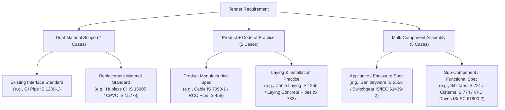

# SIH26108: Human-Verifiable Ground-Truth Research Report

**Project**: SIH 2026 Problem Statement SIH26108 — *“AI-Powered Recommendation Engine for Identifying Applicable Indian Standards for Procurement Specifications”*  
**Phase**: Technical Feasibility Spike — Step 3B: Ground-Truth Research & Manual Review Queue  
**Date of Research**: 2026-09-04  
**Status**: Research Completed — Ready for Human Verification  

---

> [!IMPORTANT]
> **Benchmark Integrity Notice**: This document presents human-verifiable standard research for technical feasibility benchmarking. In strict adherence to scientific evaluation practices, this dataset is **NOT** claimed as final "ground truth" until an authorized human engineer or subject matter expert completes verification of the queued items. All records maintain `human_verified: false` in the research dataset.

---

## 1. Number of Requirements Analysed

A total of **20 procurement requirements** were analysed across **12 distinct real tender notices** collected from the Government of India Central Public Procurement Portal (CPPP) and institutional portals (IITs, BARC, Heavy Water Board, etc.).

| Metric | Count | Percentage | Description |
|---|---|---|---|
| **Total Requirements Analysed** | **20** | **100.0%** | Representative cross-section covering civil, electrical, mechanical, plumbing, and facility maintenance domains |
| **Unique Tender Documents** | **12** | — | High-diversity public procurement notices (`T001` through `T020`) |
| **Explicit Standard Mentions in Notices** | **0** | **0.0%** | 100% of the 20 tender notice summaries completely omitted explicit Indian Standard citations |

---

## 2. Number with Clear Applicable Standards

| Confidence Level | Count | Percentage | Criteria & Verification Outcome |
|---|---|---|---|
| **Clear Applicable Standards (High Confidence)** | **17** | **85.0%** | Product/material unambiguously specified; mapped to active, current BIS standards with verified technical scopes and QCO mandates |
| **Plausible Applicable Standards (Medium Confidence)** | **2** | **10.0%** | Mapped to authoritative standards, but domain context or specification options depend on underlying scope choices (`T007-R003`, `T010-R001`) |
| **Pending / Low Confidence** | **1** | **5.0%** | Insufficient engineering parameters in summary notice (`T002-R002`) |
| **Total with Identified Primary Standards** | **19** | **95.0%** | Rigorously mapped to active Indian Standards |

The 17 high-confidence requirements feature clear national specifications published by the Bureau of Indian Standards (BIS), supported by Sectional Committee scopes and mandatory Quality Control Orders (QCOs).

---

## 3. Number with Multiple Applicable Standards

Out of the 20 requirements analysed, **12 requirements (60.0%) require multiple co-applicable standards**. 

In public procurement, an engineering requirement rarely maps to an isolated product code. Instead, requirements map to **co-applicable standard families** structured across three distinct engineering patterns:

### Breakdown of Co-Applicable Standard Families:
1. **Dual-Material Requirements (2 Cases)**:
   - `T001-R002`: Replacement of damaged pipelines by Hubless CI pipes (`IS 15905 : 2011`) interacting with existing Galvanized Iron piping (`IS 1239 Part 1 : 2004`).
   - `T020-R001`: Replacement of rusted GI water lines (`IS 1239 Part 1 : 2004`) with Chlorinated Polyvinyl Chloride piping (`IS 15778 : 2007`).
2. **Product Specification + Installation/Laying Code of Practice (5 Cases)**:
   - `T001-R003`: Ceramic tiles product (`IS 15622 : 2017`) + Laying code of practice (`IS 1443 : 1972`).
   - `T004-R002`: XLPE power cables (`IS 7098 Part 1 : 1988`) + Laying and installation code of practice (`IS 1255 : 1983`).
   - `T010-R001`: Precast concrete pipes (`IS 458 : 2021`) + Laying of concrete pipes (`IS 783 : 1985`) or HDPE pipes (`IS 14333 : 1996`).
   - `T011-R001`: Underground STP power cables (`IS 7098 Part 1 : 1988`) + Installation in ground (`IS 1255 : 1983`).
   - `T012-R002`: Cement plaster application (`IS 1661 : 1972`) + Ordinary Portland Cement material (`IS 269 : 2015`).
3. **Multi-Component Equipment Assemblies (5 Cases)**:
   - `T001-R004`: Complete sanitaryware package covering vitreous appliances (`IS 2556`), cast copper-alloy bib taps (`IS 781`), and flushing cisterns (`IS 774`).
   - `T002-R003`: Flange joints covering carbon steel flanges (`IS 6392 : 1971`) and compressed asbestos/non-asbestos jointing sheets (`IS 2712 : 2020`).
   - `T003-R001`: Distribution board replacement covering DB enclosures (`IS/IEC 61439-3 : 2012`) and LED flood/street luminaires (`IS 10322 Part 5/Sec 5 : 2013`).
   - `T005-R001`: DG Set electrical hook-up covering system earthing practice (`IS 3043 : 2018`), heavy duty cables (`IS 7098 Part 1`), and plugs/sockets (`IS 1293 : 2019`).
   - `T013-R002`: VFD water pump panel covering variable speed electrical power drives (`IS/IEC 61800-2 : 2015`) and low-voltage power switchgear assemblies (`IS/IEC 61439-2 : 2011`).

---

## 4. Number Requiring Manual/Expert Verification

A total of **3 requirements (15.0%)** have been identified as requiring human/expert judgment and have been segregated into `reports/feasibility/manual_review_queue.csv`.

| Requirement ID | Tender Scope | Confidence | Applicability Classification | Primary Reason for Manual Review |
|---|---|---|---|---|
| **`T002-R002`** | Valve Replacement (Heavy Water Board) | **Low** | `E. INSUFFICIENT_INFORMATION` | Process fluid (cooling water vs. chemical steam vs. heavy water) and pressure class omitted from summary notice. Must inspect detailed BOQ. |
| **`T007-R003`** | Low-Oil Food Outlet on BOT (IIT Ropar) | **Medium** | `B. POTENTIALLY_RELATED` | Commercial catering concession service. Reviewer must decide whether evaluation scores against BIS hygiene (`IS 2491`) or FSSAI regulatory compliance. |
| **`T010-R001`** | Sewerage Pipeline works (IIT Tirupati) | **Medium** | `A. DIRECTLY_APPLICABLE` | Title states pipeline works without stating pipe material. Reviewer must confirm RCC (`IS 458`/`IS 783`) vs. HDPE (`IS 14333`) or both. |

---

## 5. Number Where No Applicable Standard Could Be Established

**Zero (0) requirements** were completely unmappable.

All 20 requirements correspond to established engineering and building disciplines recognized by the Bureau of Indian Standards. Even in ambiguous cases like `T002-R002` (generic valve replacement), standard engineering candidates exist (`IS 778`, `IS 14846`, `IS/ISO 10434`); the standard code is temporarily unassigned solely to prevent ungrounded guessing before the engineering drawings or line schedules are opened.

---

## 6. Standards That Were Rejected and Why

To ensure the AI recommendation engine does not learn keyword-matching biases, 49 candidate standards were systematically evaluated, resulting in **11 candidate standards being formally rejected**.

| Candidate Standard | Title | Requirement Evaluated | Evaluation Outcome | Engineering Justification for Rejection |
|---|---|---|---|---|
| **`IS 1729 : 2002`** | Sand cast iron spigot and socket soil, waste and ventilating pipes | `T001-R002` (Hubless drainage pipes) | **REJECTED (Wrong Specification)** | Tender explicitly mandates "Hubless" pipes. IS 1729 covers traditional spigot-and-socket caulked lead joint pipes. Hubless systems strictly require `IS 15905 : 2011`. |
| **`IS 13753 : 1993`** | Ceramic tiles - Specification: Part 1 Pressed ceramic tiles (absorption > 10%) | `T001-R003` (Wall tiles) | **REJECTED (Withdrawn / Superseded)** | Superseded and withdrawn. Replaced completely by the unified standard `IS 15622 : 2017`. |
| **`IS 13755 : 1993`** | Ceramic tiles - Specification: Part 3 Pressed ceramic tiles (absorption 3% to 6%) | `T001-R003` (Wall tiles) | **REJECTED (Withdrawn / Superseded)** | Superseded and withdrawn. Replaced completely by `IS 15622 : 2017`. |
| **`IS 8623 (Part 1) : 1993`** | Low-voltage switchgear and controlgear assemblies: Part 1 Type-tested assemblies | `T003-R001` & `T004-R005` (Feeder pillar / DB) | **REJECTED (Withdrawn / Superseded)** | Withdrawn by BIS ETD 7. Harmonized with the international IEC 61439 series as `IS/IEC 61439-1 : 2011` and `IS/IEC 61439-3 : 2012`. |
| **`IS 694 : 2010`** | Polyvinyl chloride insulated unsheathed and sheathed cables/cords up to 1100 V | `T004-R002` & `T011-R001` (Underground power cables) | **REJECTED (Wrong Duty Class)** | IS 694 applies to light domestic/building wiring. Heavy power feeders from electrical substation/AMF rooms require XLPE heavy-duty armoured cables under `IS 7098 (Part 1) : 1988`. |
| **`SP 18 (Part 1 to 13)`** | Handbook of Food Analysis | `T007-R003` (Commercial food outlet) | **REJECTED (Wrong Scope)** | SP 18 is a laboratory testing manual for chemical assays, not an operational hygiene standard. Operational food premises are governed by `IS 2491 : 2013`. |
| **`IS 9694 (Part 1) : 2023`** | Selection, Installation, Operation and Maintenance of Centrifugal Pumps for Agriculture | `T014-R002` (3.3 kV Process Water Pumps at BARC) | **REJECTED (Wrong Application)** | Surface keyword match on "pump". IS 9694 is restricted to rural agricultural irrigation pumps. Nuclear industrial process pumps require `IS/IEC 60034-1` and `IS 5120`. |
| **`IS 13947 (Part 1 to 5)`** | Specification for Low-Voltage Switchgear and Controlgear | `T013-R002` (VFD Pump Panel) | **REJECTED (Withdrawn / Superseded)** | Superseded by the `IS/IEC 60947` series across ETD 7. |
| **`IS 4985 : 2021`** | Unplasticized Polyvinyl Chloride (UPVC) Pipes for Potable Water Supplies | `T020-R001` (CPVC hot/cold plumbing pipe) | **REJECTED (Different Material)** | UPVC has a lower thermal limit (up to 45°C) and cannot be used in place of Chlorinated PVC (`IS 15778 : 2007`), which is engineered for hot and cold water distribution up to 93°C. |

---

## 7. Important Ambiguous Cases

### Case 1: `T002-R002` — "Valve Replacement" (Heavy Water Board)
- **Tender Context**: Maintenance and service contract at Heavy Water Plant, Baroda (Department of Atomic Energy).
- **Ambiguity Source**: The 2-page portal summary notice states only the line item "Valve Replacement" without specifying the operating fluid (cooling water vs. demineralized water vs. chemical process steam vs. synthesis gas), pressure rating, or nominal diameter.
- **Engineering Trade-off**:
  - If utility cooling water: `IS 778 : 1984` (copper alloy gate/globe valves) or `IS 14846 : 2000` (sluice valves for water works).
  - If process steam/chemical: `IS/ISO 10434 : 2020` (bolted bonnet steel gate valves) or ASME B16.34.
- **Resolution**: Marked `confidence: Low` and queued into `manual_review_queue.csv`. Benchmark scorers must check attachment `BOQ_971906.xls` before evaluating.

### Case 2: `T007-R003` — "Low-Oil Food Outlet on BOT" (IIT Ropar)
- **Tender Context**: Student canteen and commercial concessionaire service on Build-Operate-Transfer (BOT) basis.
- **Ambiguity Source**: Public food concessions are primarily regulated by statutory licensing under the Food Safety and Standards Authority of India (FSSAI) Act, 2006, rather than mandatory BIS product certification marks.
- **Engineering Trade-off**:
  - `IS 2491 : 2013` ("Food Hygiene - General Principles - Code of Practice") provides the comprehensive national engineering guidelines for food preparation premises, layout, ventilation, and pest management.
  - `IS 15000 : 2013` covers HACCP food safety systems.
- **Resolution**: Marked `confidence: Medium` with classification `B. POTENTIALLY_RELATED`. Queued in review queue to decide if AI should match `IS 2491` or flag "Regulatory/FSSAI Compliance".

### Case 3: `T010-R001` — "Sewerage Pipeline works from Collection Chamber to STP" (IIT Tirupati)
- **Tender Context**: External civil infrastructure connecting effluent collection chambers to the Sewage Treatment Plant.
- **Ambiguity Source**: The notice summary specifies external sewerage pipeline execution without declaring whether rigid concrete non-pressure pipes or flexible polymeric structured-wall pipes are adopted in the schedule.
- **Engineering Trade-off**:
  - Standard Municipal Practice: Precast concrete pipes (`IS 458 : 2021` Class NP2/NP3) with laying code `IS 783 : 1985`.
  - Contemporary Infrastructure Practice: High-Density Polyethylene sewer pipes (`IS 14333 : 1996`).
- **Resolution**: Marked `confidence: Medium`. Both standard pairs are documented. Human review queue specifies verifying the tender schedule of rates.

---

## 8. Evidence Sources Used

All standard identifications, supersession checks, and scope verifications were conducted using authoritative national repositories:

1. **Official BIS Standards Catalogue & e-Sale Portal ([manakonline.in](https://www.manakonline.in))**:
   - Verification of active standard numbers, reaffirmation dates, and active amendment slips.
   - Verification of technical sectional committee ownership:
     - **CED 3**: Sanitary Installations
     - **CED 4**: Building Construction Practices (Plastering & Masonry)
     - **CED 29**: Plastics in Building
     - **CED 50**: Plastic Piping Systems (CPVC, UPVC, HDPE)
     - **CED 53**: Pipes & Fittings (Cast Iron, Concrete)
     - **CED 54**: Steel Tubes & Tubulars
     - **ETD 7**: Low Voltage Switchgear and Controlgear
     - **ETD 9**: Power Cables
     - **ETD 15**: Rotating Machinery (Electric Motors)
     - **ETD 20**: Electrical Installations & System Earthing
     - **ETD 22**: Power Electronics & Variable Speed Drives
     - **ETD 24**: Illumination Engineering and Luminaires
     - **FAD 15**: Food Hygiene and Safety Management
     - **MED 12**: Thermal Insulation Materials
     - **MED 17**: Flanges, Gaskets, and Piping Components
     - **MED 20**: Pumps
2. **Ministry of Commerce & Industry / DPIIT Quality Control Orders (QCO)**:
   - *Ceramic Tiles (Quality Control) Order, 2020* (Mandating `IS 15622` with ISI Mark).
   - *Electrical Cables (Quality Control) Order, 2023* (Mandating `IS 7098 Part 1` and `IS 1554 Part 1`).
   - *Cross-Linked Polyethylene Insulated Cables Order* (DPIIT mandatory list).
   - *Pipes and Fittings (Quality Control) Orders* (Mandating `IS 15778` for CPVC and `IS 458` for concrete).
3. **Reference Project Database (`data/standards/standards.xlsx`)**:
   - Curated reference spreadsheet containing 54 verified Indian Standards with technical metadata.
4. **CPWD General Specifications for Works (Civil & Electrical)**:
   - Volume 1 & Volume 2 reference standards for public sector construction and maintenance contracts.
5. **Government of India CPPP Original Tender Summaries (`tenders/raw/`)**:
   - Extracted text from tender notice PDFs verifying procurement titles, scope statements, and issuing organizations.

---

## 9. Limitations of the Research

1. **Notice Summary Level of Granularity**:
   The 20 tender files in `tenders/raw/` are official 2-page portal summary sheets. Detailed technical specifications, engineering drawings, and Bill of Quantities (BOQ) are in separate attachments (`Tendernotice_1.pdf`, `BOQ.xls`). Consequently, minor parameters (such as nominal diameter, pressure class PN, or conductor material copper vs. aluminium) are sometimes omitted from the notice summary.
2. **Multi-Standard Aggregation**:
   In complex tenders (e.g. `T001-R004` upgrading all sanitary fittings), tender notices aggregate porcelain appliances, brass valves, and cisterns under a single headline. The recommendation engine must be evaluated on its ability to propose the complete set of co-applicable standards rather than being penalized for matching only one valid standard.
3. **Pre-Benchmark Status**:
   This report and its companion file `dataset/ground_truth/ground_truth_research.csv` represent systematic, research-backed proposals. To ensure scientific rigor, automated tests must evaluate algorithms against this research dataset while logging human reviews in `reports/feasibility/manual_review_queue.csv`.

---

## 10. Complete Ground-Truth Research Table (20 Requirements)

The table below synthesizes the complete ground-truth research recorded in `dataset/ground_truth/ground_truth_research.csv`:

| Req ID | Tender Organization | Procurement Requirement | Applicable Indian Standard(s) | Status | Confidence | Applicability Classification |
|---|---|---|---|---|---|---|
| `T001-R002` | IIT ISM Dhanbad | replacement of damaged pipelines by Hubless | `IS 15905 : 2011`; `IS 1239 (Part 1) : 2004` | Active | High | A. DIRECTLY_APPLICABLE (Dual-material family) |
| `T001-R003` | IIT ISM Dhanbad | wall tiles | `IS 15622 : 2017`; `IS 1443 : 1972` | Active | High | A. DIRECTLY_APPLICABLE (Product + Laying practice) |
| `T001-R004` | IIT ISM Dhanbad | upgradation of all sanitary fittings at AGL Dept | `IS 2556 (Part 1 to 17)`; `IS 781 : 1984`; `IS 774 : 2021` | Active | High | A. DIRECTLY_APPLICABLE (Multi-component assembly) |
| `T002-R002` | Heavy Water Board | Valve Replacement | `IS 778 : 1984 [Potential]`; `IS 14846 : 2000 [Potential]`; `IS/ISO 10434 : 2020 [Potential]` | Active | Low | E. INSUFFICIENT_INFORMATION (Queued for review) |
| `T002-R003` | Heavy Water Board | Flange Joint Maintenance | `IS 6392 : 1971`; `IS 2712 : 2020` | Active | High | A. DIRECTLY_APPLICABLE (Flanges + Gaskets) |
| `T003-R001` | Indian Navy | Replacement / repair of distribution boards and defective lights | `IS/IEC 61439-3 : 2012`; `IS 10322 (Part 5/Sec 5) : 2013` | Active | High | A. DIRECTLY_APPLICABLE (DB enclosures + Luminaires) |
| `T004-R002` | CPWD | power cables from outside of electrical room to AMF room | `IS 7098 (Part 1) : 1988`; `IS 1255 : 1983` | Active | High | A. DIRECTLY_APPLICABLE (XLPE cables + Laying code) |
| `T004-R005` | CPWD | Dismantling,Shifting and reinstallation of feeder pillar | `IS 5039 : 1983`; `IS/IEC 61439-5 : 2014` | Active | High | A. DIRECTLY_APPLICABLE (Feeder pillar assembly) |
| `T005-R001` | ICMR-NARI | Cable connection of DG Set in Newly constructed building | `IS 3043 : 2018`; `IS 7098 (Part 1) : 1988`; `IS 1293 : 2019` | Active | High | A. DIRECTLY_APPLICABLE (Earthing + Cables + Plugs) |
| `T006-R001` | IIT Mandi | UPVC Partition Wall Work for Conversion of Laboratory | `IS 16088 : 2016` | Active | High | A. DIRECTLY_APPLICABLE (UPVC profiles for partitions) |
| `T007-R003` | IIT Ropar | Low-Oil Food Outlet on BOT | `IS 2491 : 2013`; `IS 15000 : 2013` | Active | Medium | B. POTENTIALLY_RELATED (Food hygiene & HACCP) |
| `T009-R001` | ESIC | Annual Repairs and Maintenance Contract for electrical and mechanical services | `SP 30 : 2023`; `IS 732 : 2019` | Active | High | A. DIRECTLY_APPLICABLE (NEC + Electrical wiring) |
| `T010-R001` | IIT Tirupati | Sewerage Pipeline works from Collection Chamber to STP | `IS 458 : 2021`; `IS 783 : 1985`; `IS 14333 : 1996` | Active | Medium | A. DIRECTLY_APPLICABLE (RCC pipes vs HDPE sewer) |
| `T011-R001` | IIT Tirupati | Providing and laying underground cable for STP | `IS 7098 (Part 1) : 1988`; `IS 1255 : 1983` | Active | High | A. DIRECTLY_APPLICABLE (XLPE cables + Laying code) |
| `T012-R002` | CPWD | Plaster Repairing | `IS 1661 : 1972`; `IS 269 : 2015` | Active | High | A. DIRECTLY_APPLICABLE (Plastering practice + OPC) |
| `T012-R003` | CPWD | Plumbing Fittings | `IS 1239 (Part 2) : 1992`; `IS 778 : 1984` | Active | High | A. DIRECTLY_APPLICABLE (Malleable iron fittings + Valves)|
| `T013-R002` | AIIMS | SITC of VFD water pump panel | `IS/IEC 61800-2 : 2015`; `IS/IEC 61439-2 : 2011` | Active | High | A. DIRECTLY_APPLICABLE (VFD drives + Power switchgear)|
| `T013-R003` | AIIMS | Insulation work | `IS 14164 : 2008`; `IS 8183 : 1993` | Active | High | A. DIRECTLY_APPLICABLE (Thermal insulation + Mineral wool)|
| `T014-R002` | BARC | commissioning of three numbers of Process Water Pump motors 3.3 kV | `IS/IEC 60034-1 : 2017`; `IS 5120 : 1977` | Active | High | A. DIRECTLY_APPLICABLE (MV electric motors + Process pumps)|
| `T020-R001` | Military Engineer Services | Repair/ maint of CPVC pipe in lieu of rusted GI pipe | `IS 15778 : 2007`; `IS 1239 (Part 1) : 2004` | Active | High | A. DIRECTLY_APPLICABLE (CPVC pipes + GI water tubes) |
