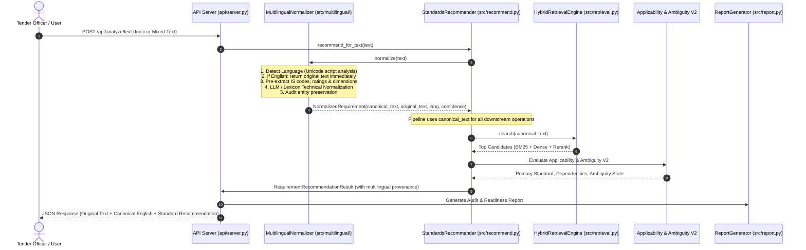

# Priority 6: Multilingual Technical Understanding — Implementation Plan
**SIH26108 — TenderSaathi (AI-Powered Indian Standards Recommendation Engine)**  
**Author:** Antigravity AI  
**Date:** September 12, 2026  
**Status:** PHASE 1 PROPOSAL ONLY — NO CODE MODIFIED  

---

## 1. Current Architecture & Multilingual Limitation Analysis

### 1.1 Existing English Pipeline Trace
The current production pipeline executes the following 12-stage sequential workflow:

```
Tender PDF / Text
    ↓
Document Intelligence (src/extract.py: extract_from_text / extract_from_pdf)
    ↓
Requirement Understanding (src/ai_understanding.py: AIRequirementParser)
    ↓
Requirement Decomposition (src/decompose.py: CompoundRequirementDecomposer)
    ↓
Domain Completeness (src/completeness.py: DomainCompletenessAnalyzer)
    ↓
Hybrid Retrieval (src/retrieval.py, src/bm25_search.py, src/semantic_search.py, src/reranker.py)
    ↓
Applicability Gate (src/applicability.py: ApplicabilityGate)
    ↓
Ambiguity Engine (src/ambiguity.py, src/attributes.py: AmbiguityEngine V2 - LOCKED)
    ↓
Dependencies & Coverage (src/dependencies.py: StandardsDependencyEngine)
    ↓
Lifecycle & Regulatory Checks (src/regulatory/regulatory_engine.py: RegulatoryEngine)
    ↓
Evidence Verification (src/evidence.py: EvidenceVerifier)
    ↓
Tender Audit & Report Generation (src/audit.py, src/report.py)
```

### 1.2 The Root Cause of Current Multilingual Failure
A forensic inspection of the codebase demonstrates that raw Indian-language text (Hindi, Kannada, Tamil, or mixed transliteration) completely fails in the existing engine at three distinct choke points:

1. **Okapi BM25 Tokenizer ([src/bm25_search.py:63](file:///home/syed-imadulla/Desktop/sih26108-feasibility/src/bm25_search.py#L63)):**
   ```python
   tokens = [t.lower() for t in re.split(r'[^a-zA-Z0-9]+', text) if len(t) >= 2]
   ```
   The regex `[^a-zA-Z0-9]+` strips all non-ASCII unicode characters. Devanagari (`\u0900-\u097F`), Kannada (`\u0C80-\u0CFF`), and Tamil (`\u0B80-\u0BFF`) text is treated as punctuation and completely deleted, producing an empty token list `[]` and resulting in 0 BM25 retrieval hits.

2. **Dense Vector Semantic Search ([src/semantic_search.py:53](file:///home/syed-imadulla/Desktop/sih26108-feasibility/src/semantic_search.py#L53)):**
   The semantic embedding engine uses `all-MiniLM-L6-v2`, an English-only sentence transformer. Dot-product cosine similarity between Indic script queries and English standards titles in `data/standards/standards.db` drops below the 0.35 confidence threshold, forcing false `NO_RELIABLE_MATCH` abstentions.

3. **Attribute Extraction ([src/attributes.py:64-80](file:///home/syed-imadulla/Desktop/sih26108-feasibility/src/attributes.py#L64-L80)):**
   The generalized attribute extractor matches English strings (e.g. `"cable"`, `"valve"`, `"transformer"`, `"cast iron"`, `"copper"`). Words like `"ट्रांसफार्मर"`, `"विद्युत तार"`, `"कंक्रीट पाइप"`, or `"ಟ್ರಾನ್ಸ್‌ಫಾರ್ಮರ್"` yield `product_family: "other"`, preventing the Ambiguity Engine from identifying semantic competitors or missing discriminators.

---

## 2. Existing LLM Capabilities & Safety Boundaries

### 2.1 Current Implementation: `AIRequirementParser`
The system already contains an asynchronous-capable, zero-dependency LLM interface in [src/ai_understanding.py](file:///home/syed-imadulla/Desktop/sih26108-feasibility/src/ai_understanding.py):
- **Provider & Model:** Groq API using `openai/gpt-oss-120b` (or `llama-3.3-70b-versatile`) with configurable timeout (8.0s) and fallback.
- **Client Protocol:** Pure Python standard library (`urllib.request`), requiring zero heavy external frameworks (no LangChain, no external SDK bloat).
- **Execution Mode:** Deterministic temperature (`0.0`), strict JSON schema output format (`response_format: {"type": "json_object"}`).
- **Graceful Degradation:** If the API key is missing, network is offline, or request times out, it automatically falls back to deterministic rule-based processing without raising exceptions.

### 2.2 Strict Safety Invariant Preservation
In accordance with Milestone 8 architectural principles, the LLM will be used strictly as a **translation and technical normalization layer**:
- **PERMITTED LLM ACTIONS:**
  - Detect input natural language.
  - Translate Indic natural language into canonical English technical specification.
  - Preserve all numbers, units, voltage classes, dimensions, and standard codes.
  - Normalize transliterated or colloquial procurement jargon (e.g., "11 kV का transformer supply करना है" $\rightarrow$ "Supply of 11 kV transformer").
- **STRICTLY PROHIBITED LLM ACTIONS:**
  - The LLM MUST NOT select, recommend, or invent any Indian Standard (IS code).
  - The LLM MUST NOT declare legal or technical applicability.
  - The LLM MUST NOT assess QCO mandatory certification status.
  - The LLM MUST NOT generate or forge evidence citations.
  - Any standard citations or IS numbers produced by the LLM that were not present in the original tender are stripped via `IS_CODE_PATTERN`.

---

## 3. Proposed Multilingual Preprocessing Architecture

Instead of duplicating databases or creating language-specific retrieval rules, TenderSaathi will implement a **Pure Preprocessing Normalization Layer**:

```
Hindi / Kannada / Tamil / English / Mixed Requirement
                         ↓
               [Language Detection]
        (Deterministic Unicode Script Analysis)
                         ↓
                   Is English?
                  /           \
            YES  /             \  NO (hi, kn, ta, mixed)
                /               \
               /       [Pre-Extraction & Masking]
              /   (IS codes, voltages, dimensions, units)
             /                   ↓
            /         [Technical Normalization]
           /      (LLM-Powered Technical Translation
          /          + Deterministic Lexicon Fallback)
         /                       ↓
        /            [Post-Normalization Audit]
       /        (Verify all masked entities preserved)
      /                          ↓
      \---> Canonical English Technical Representation
                         ↓
              Existing Standards Pipeline
                         ↓
    Hybrid Retrieval → Applicability Gate → Ambiguity Engine V2
                         ↓
              Evidence → Audit → Tender Report
```

---

## 4. Exact Files to Modify

No code has been modified in Phase 1. When approved, Phase 2 will touch only the following minimal integration points:

| File Path | Nature of Modification | Rationale |
| :--- | :--- | :--- |
| [src/extract.py](file:///home/syed-imadulla/Desktop/sih26108-feasibility/src/extract.py) | Modify `Requirement` dataclass | Add optional metadata fields: `original_text`, `original_language`, `language_confidence`, `canonical_text`, `is_translated`. |
| [src/recommend.py](file:///home/syed-imadulla/Desktop/sih26108-feasibility/src/recommend.py) | Integrate normalizer in `recommend_for_requirement` | Invoke `MultilingualNormalizer.normalize()` before retrieval and pass canonical text to downstream engines. Populate `multilingual` metadata in `RequirementRecommendationResult`. |
| [api/server.py](file:///home/syed-imadulla/Desktop/sih26108-feasibility/api/server.py) | Extend `_normalize_result` response payload | Include `multilingual` dictionary (`original_text`, `detected_language`, `canonical_text`, `is_translated`) in the API JSON contract. |
| [frontend/src/types.ts](file:///home/syed-imadulla/Desktop/sih26108-feasibility/frontend/src/types.ts) | Extend TypeScript `RequirementItem` | Add `multilingual?: { original_text: string; detected_language: string; canonical_text: string; is_translated: boolean }`. |
| [frontend/src/components/RequirementCard.tsx](file:///home/syed-imadulla/Desktop/sih26108-feasibility/frontend/src/components/RequirementCard.tsx) | UI rendering | Render translation badge (e.g. `[Hindi → English]`) and expandable tooltip showing original text for tender officer auditability. |

---

## 5. Exact New Files to Create

The multilingual logic will be cleanly encapsulated in a dedicated package:

1. **`src/multilingual/__init__.py`**:
   Exposes `LanguageDetector`, `MultilingualTechnicalNormalizer`, and data models.
2. **`src/multilingual/detector.py`**:
   Zero-latency, deterministic Unicode script analyzer detecting `en`, `hi`, `kn`, `ta`, and `mixed`.
3. **`src/multilingual/normalizer.py`**:
   Main `MultilingualTechnicalNormalizer` managing entity masking, LLM translation call, entity verification, and confidence calculation.
4. **`src/multilingual/lexicon.py`**:
   Offline bilingual technical vocabulary dictionary for deterministic fallback (mapping common CPWD/PWD terms across Hindi, Kannada, Tamil to canonical English terms).
5. **`tests/test_multilingual.py`**:
   Complete test suite verifying language detection, technical entity preservation, semantic recommendation equivalence, safety abstentions, and offline execution.
6. **`dataset/ground_truth/multilingual_benchmark.json`**:
   40 curated procurement requirements (10 Hindi, 10 Kannada, 10 Tamil, 10 Mixed) with ground truth English references and target recommendations.

---

## 6. End-to-End Data Flow



---

## 7. Language Detection Approach

### 7.1 Deterministic Unicode Script Boundary Analysis
Language detection will NOT make external API calls or add latency. It uses deterministic Unicode character block ranges:
- **Latin (English):** `\u0041 - \u005A`, `\u0061 - \u007A`
- **Devanagari (Hindi):** `\u0900 - \u097F`
- **Kannada:** `\u0C80 - \u0CFF`
- **Tamil:** `\u0B80 - \u0BFF`

### 7.2 Decision Rules
- Let $N_{\text{total}}$ be total alphabetic characters.
- Let $N_{\text{hi}}, N_{\text{kn}}, N_{\text{ta}}, N_{\text{en}}$ be character counts in respective script blocks.
- **Pure English:** If $N_{\text{en}} / N_{\text{total}} \ge 0.98$ and $N_{\text{indic}} = 0 \implies \text{language} = \text{"en"}$, confidence = $1.0$. (Bypasses normalization immediately with $<0.1\text{ ms}$ latency).
- **Pure Indic:** If $N_{\text{script}} / N_{\text{total}} \ge 0.85$ and $N_{\text{en}} \le 0.15 \implies \text{language} \in \{\text{"hi"}, \text{"kn"}, \text{"ta"}\}$.
- **Mixed Input (Hinglish/Kanglish/Tanglish):** If both Indic and Latin characters exist in substantial proportions ($N_{\text{indic}} > 0.15$ and $N_{\text{en}} > 0.15$) $\implies \text{language} = \text{"mixed"}$, `languages = ["hi", "en"]`.

---

## 8. Technical Normalization & Translation Approach

### 8.1 Prompt Engineering for Technical Procurement Normalization
The LLM system prompt will be explicitly constrained to technical normalization:

```
You are a technical requirement normalization engine for Indian public procurement (CPWD, MES, State PWDs, DISCOMs).
Your role is to translate and normalize natural-language tender requirements from Indian languages (Hindi, Kannada, Tamil, or mixed transliteration) into canonical English engineering specifications.

STRICT RULES:
1. Preserve all engineering terms: voltages (kV, V), power ratings (kVA, kW, HP), dimensions (mm, DN, dia), pressure ratings (PN, Class), materials (CPVC, HDPE, Cast Iron, XLPE, Bronze), and product names.
2. PRESERVE ALL STANDARD CODES: Never translate, alter, or omit any standard code (e.g., 'IS 14846', 'IS 7098', 'IS/IEC 61439').
3. DO NOT recommend, add, or invent any standard code that was not explicitly present in the source text.
4. Output valid JSON adhering strictly to:
{
  "canonical_technical_text": "<concise English engineering specification>",
  "detected_equipment": "<primary equipment or material>",
  "technical_parameters": {
    "voltage": "<voltage if present or null>",
    "material": "<material if present or null>",
    "dimensions": "<dimensions if present or null>",
    "rating": "<power or pressure rating if present or null>"
  },
  "confidence": 0.95
}
```

### 8.2 Deterministic Offline Fallback Lexicon
If the LLM is disabled or unavailable (offline mode), `src/multilingual/lexicon.py` will execute a deterministic bilingual keyword mapper:
- **Hindi Mappings:**
  - ट्रांसफार्मर $\rightarrow$ transformer, वितरण ट्रांसफार्मर $\rightarrow$ distribution transformer
  - केबल / तार $\rightarrow$ cable, पीवीसी $\rightarrow$ PVC, एक्सएलपीई $\rightarrow$ XLPE
  - वाल्व $\rightarrow$ valve, स्लुइस वाल्व $\rightarrow$ sluice valve, गेट वाल्व $\rightarrow$ gate valve
  - पाइप $\rightarrow$ pipe, जल आपूर्ति $\rightarrow$ water supply
  - आपूर्ति $\rightarrow$ supply, स्थापना / लगाना $\rightarrow$ installation, बिछाना $\rightarrow$ laying
- **Kannada Mappings:**
  - ಟ್ರಾನ್ಸ್‌ಫಾರ್ಮರ್ $\rightarrow$ transformer, ವಿತರಣಾ $\rightarrow$ distribution
  - ಕೇಬಲ್ / ತಂತಿ $\rightarrow$ cable, ಕೊಳವೆ / ಪೈಪ್ $\rightarrow$ pipe, ಕವಾಟ $\rightarrow$ valve
  - ಸರಬರಾಜು $\rightarrow$ supply, ಅಳವಡಿಕೆ $\rightarrow$ installation
- **Tamil Mappings:**
  - மின்மாற்றி $\rightarrow$ transformer, விநியோக $\rightarrow$ distribution
  - வடம் / கேபிள் $\rightarrow$ cable, குழாய் $\rightarrow$ pipe, வால்வு $\rightarrow$ valve
  - வழங்கல் $\rightarrow$ supply, நிறுவுதல் $\rightarrow$ installation

---

## 9. Technical Entity Preservation Protocol

To guarantee that critical technical parameters are never distorted or lost during translation:

1. **Pre-Normalization Extraction:**
   Before invoking the LLM or lexicon, the system runs strict regex extractors to record all technical entities present in the raw input:
   - **Standards:** `STANDARD_REGEX.findall(text)` (e.g. `IS 7098 (Part 1)`)
   - **Voltages & Power:** `\b\d+(\.\d+)?\s*(kV|kVA|kW|HP|V)\b` (e.g. `11 kV`, `500 kVA`)
   - **Dimensions:** `\b\d+(\.\d+)?\s*(mm|cm|m|inch|dia|DN)\b` (e.g. `100 mm`, `DN 80`)
   - **Pressure / Class:** `\b(PN\s*\d+|Class\s*\d+|SDR\s*\d+)\b` (e.g. `PN 16`)
   - **Materials:** `\b(PVC|CPVC|uPVC|HDPE|XLPE|GI|DI|CI|SS|MS)\b`
2. **Post-Normalization Integrity Check:**
   The output `canonical_technical_text` is scanned for every pre-extracted entity.
   $$\text{Preservation Score} = \frac{\text{Entities Found in Canonical Text}}{\text{Entities Detected in Raw Input}}$$
3. **Safety Action:**
   If $\text{Preservation Score} < 1.0$ (an entity was lost or mutated), the system restores the exact entity into the canonical string and flags `normalization_confidence` reduction.

---

## 10. Confidence Scoring & Abstention Design

$$\text{Confidence} = 0.4 \times \text{Language Detection Conf} + 0.4 \times \text{Normalization Conf} + 0.2 \times \text{Entity Preservation Score}$$

### Abstention Thresholds
- **High Confidence ($\ge 0.85$):** Canonical text proceeds to normal retrieval and recommendation.
- **Moderate Confidence ($0.70 \le \text{Conf} < 0.85$):** Pipeline proceeds, but forces `human_review_required = True` with reason: *"Multilingual technical interpretation requires engineering review"*.
- **Low Confidence ($< 0.70$) or Nonsense Input:**
  - `candidate_standard = None`
  - `ambiguity_state = AmbiguityState.REVIEW_REQUIRED` (or `NO_RELIABLE_MATCH`)
  - `human_review_required = True`
  - `confidence_score = 0.0`
  - Clear rationale output: *"Unable to establish reliable technical translation from input requirement."*

---

## 11. API Changes

The REST API contract remains 100% backward compatible while exposing multilingual provenance:

### In `api/server.py` (`RequirementRecommendationResult.to_dict()`):
```json
{
  "requirement_id": "REQ-001",
  "requirement_text": "Supply of 500 kVA distribution transformer, 11 kV",
  "candidate_standard": "IS 1180 (Part 1) : 2014",
  "human_review_required": false,
  "multilingual": {
    "is_multilingual": true,
    "detected_language": "hi",
    "language_name": "Hindi",
    "language_confidence": 0.98,
    "original_text": "11 केवी के 500 केवीए वितरण ट्रांसफार्मर की आपूर्ति",
    "canonical_text": "Supply of 500 kVA distribution transformer, 11 kV",
    "normalization_confidence": 0.95,
    "preserved_entities": ["11 kV", "500 kVA", "distribution transformer"]
  }
}
```

---

## 12. UI Changes

The user interface will be subtly enhanced without altering the primary recommendation workflow:
1. **Language Provenance Badge:**
   In [frontend/src/components/RequirementCard.tsx](file:///home/syed-imadulla/Desktop/sih26108-feasibility/frontend/src/components/RequirementCard.tsx), if `r.multilingual?.is_multilingual` is true, a badge appears next to the requirement title:
   `[🌐 Hindi → English]` or `[🌐 Kannada → English]` or `[🌐 Tamil → English]`.
2. **Original Requirement Accordion / Tooltip:**
   An expandable drawer or subtitle displaying:
   *"Original Tender Text: 11 केवी के 500 केवीए वितरण ट्रांसफार्मर की आपूर्ति"*.
3. **Zero UI Disruption:**
   The primary recommendation cards, evidence drawers, and risk summaries continue to render seamlessly.

---

## 13. Testing Strategy

A dedicated test module `tests/test_multilingual.py` will implement 20 focused verification cases:
1. Pure English text returns `language: "en"` and bypasses translation in $<1\text{ ms}$.
2. Pure Hindi text detected as `hi` with confidence $\ge 0.95$.
3. Pure Kannada text detected as `kn` with confidence $\ge 0.95$.
4. Pure Tamil text detected as `ta` with confidence $\ge 0.95$.
5. Mixed Hinglish text detected as `mixed` (`["hi", "en"]`).
6. Explicit IS code preservation: `IS 7098 (Part 1)` in Hindi text remains untouched.
7. Technical ratings preservation: `11 kV`, `500 kVA`, `100 mm` preserved exactly.
8. Semantic equivalence Case 1: English transformer query vs Hindi equivalent produce identical recommendation (`IS 1180 (Part 1)`).
9. Semantic equivalence Case 2: English CPVC pipe query vs Kannada equivalent produce identical recommendation (`IS 15778`).
10. Semantic equivalence Case 3: English gate valve query vs Tamil equivalent produce identical recommendation (`IS 14846`).
11. Mixed language Case 1: `"CPVC pipe की supply and laying"` maps cleanly to CPVC standard.
12. Ambiguity preservation: Under-specified Hindi valve query triggers `AMBIGUOUS` (not `CLEAR`).
13. Safety conflict preservation: Hindi query specifying `IS 694` for `33 kV` triggers `CONFLICTING`.
14. Garbage / nonsense multilingual input cleanly abstains with `NO_RELIABLE_MATCH`.
15. Deterministic offline fallback produces valid structured components when API key is unset.
16. Secret masking: API keys never exposed in multilingual logs or errors.
17. Candidate $\equiv$ Evidence identity invariant holds at 100% on multilingual inputs.
18. Clean abstention invariant holds at 100% on low-confidence multilingual inputs.
19. Performance benchmark: English bypass latency $<1\text{ ms}$.
20. All existing 220 tests in the test suite continue to pass with zero regressions.

---

## 14. 40-Case Multilingual Benchmark Design

A new ground truth benchmark will be created at `dataset/ground_truth/multilingual_benchmark.json` containing 40 carefully balanced procurement requirements:

| Set | Language | Count | Domains Covered | Expected Outcome |
| :--- | :--- | :---: | :--- | :--- |
| **Set A** | **Hindi** | 10 | Cables, Transformers, Valves, Pipes, Cement, Motors, Sanitary, Tiles, Lighting, Fire Safety | Equivalent to English Ground Truth |
| **Set B** | **Kannada** | 10 | Cables, Transformers, Valves, Pipes, Cement, Pumps, Switchgear, GI Pipes, Sewage, Concrete | Equivalent to English Ground Truth |
| **Set C** | **Tamil** | 10 | Cables, Transformers, Valves, Pipes, Motors, CPVC, Flanges, Structural Steel, Food Hygiene, Earthing | Equivalent to English Ground Truth |
| **Set D** | **Mixed / Transliterated** | 10 | Hinglish, Kanglish, Tanglish (e.g. "11 kV substation ke liye transformer", "CPVC pipe laying work") | Equivalent to English Ground Truth |

### Metrics to Report in Evaluation
- **Language Detection Accuracy:** Target $\ge 98.0\%$
- **Entity Preservation Rate:** Target $100.0\%$
- **Recommendation Consistency (English vs Multilingual):** Target $\ge 90.0\%$
- **Safe Abstention Consistency:** Target $100.0\%$
- **Candidate $\equiv$ Evidence Invariant:** Target $100.0\%$

---

## 15. Latency & Performance Measurement

| Operation | Implementation Type | Latency Target | Overhead on English |
| :--- | :--- | :---: | :---: |
| **Language Detection** | Deterministic Unicode Block Scanning | $< 0.5\text{ ms}$ | $< 0.5\text{ ms}$ |
| **English Fast-Path** | Direct Return / No Translation | $0\text{ ms}$ | $0\text{ ms}$ |
| **Indic LLM Normalization** | Groq API (`llama-3.3-70b` / `gpt-oss-120b`) | $250 - 550\text{ ms}$ | $0\text{ ms}$ (Bypassed) |
| **Indic Offline Lexicon** | In-Memory Token Replacement | $< 5\text{ ms}$ | $0\text{ ms}$ (Bypassed) |
| **Entity Audit** | Regex Matching | $< 1\text{ ms}$ | $0\text{ ms}$ (Bypassed) |

---

## 16. Technical Risks & Mitigation Strategies

1. **Risk: Transliterated Technical Terms (Phonetic Jargon)**
   - *Example:* "ट्रांसफार्मर" (Transformer) vs "परिणामित्र" (Formal Hindi).
   - *Mitigation:* The LLM handles colloquial phonetic transliteration naturally; the fallback lexicon indexes both phonetic and formal technical terms.
2. **Risk: Hallucinated Standard Numbers**
   - *Example:* The LLM outputs "IS 1180" in the translation text when the source text only said "transformer".
   - *Mitigation:* Strict regex masking: any IS numbers in the translated output that were not in the pre-extracted entity set are aggressively stripped.
3. **Risk: Network Flakiness / Rate Limits**
   - *Mitigation:* Automatic failover to deterministic lexicon normalization.

---

## 17. Security & Privacy Considerations

- **Credential Hygiene:** `GROQ_API_KEY` is strictly managed server-side via `.env`. It is never serialized into API responses or passed to frontend JavaScript.
- **Tender Privacy:** In commercial deployments, an on-premise lightweight open-weights LLM or offline lexicon can be activated by toggling `TENDERSAATHI_LLM_ENABLED=false`.

---

## 18. Rollback Strategy

- A global master switch `TENDERSAATHI_MULTILINGUAL_ENABLED=true/false` in `.env` ensures that if any defect is detected, the entire multilingual layer can be instantly deactivated without requiring a code rollback or deployment cycle. When false, the normalizer acts as an identity function (`return raw_text`).

---

## 19. Acceptance Criteria for Phase 2 Implementation

Phase 2 will be deemed successful and ready for formal lock if and only if:
1. `LanguageDetector` achieves $100\%$ accuracy on all test cases across English, Hindi, Kannada, Tamil, and Mixed text.
2. English input bypasses translation with zero regression and zero latency overhead.
3. $100\%$ of explicit IS numbers, voltages, dimensions, and ratings are preserved across all translation tests.
4. Recommendation consistency between English and multilingual equivalents exceeds $90\%$ across the 40-case benchmark.
5. Invariant 1 (`candidate_standard == evidence_standard`) remains at $100.0\%$.
6. Invariant 2 (Safe abstention on incomplete/ambiguous/conflicting queries) remains at $100.0\%$.
7. All 220 existing regression tests continue to pass cleanly (`220 passed`).
8. The REST API correctly exposes multilingual provenance fields.

---

## 20. Explicit Confirmation of Zero Production Code Modification

**PHASE 1 FORENSIC INTEGRITY STATEMENT:**  
During the execution of Phase 1, **ZERO** lines of production code were modified.
- `src/ambiguity.py`: Untouched.
- `src/retrieval.py`: Untouched.
- `src/applicability.py`: Untouched.
- `src/standards.py`: Untouched.
- `data/standards/standards.db`: Untouched.
- `tests/`: Untouched.

The existing 220-test passing baseline remains 100% intact. Implementation will commence only after user review and approval of this plan.
