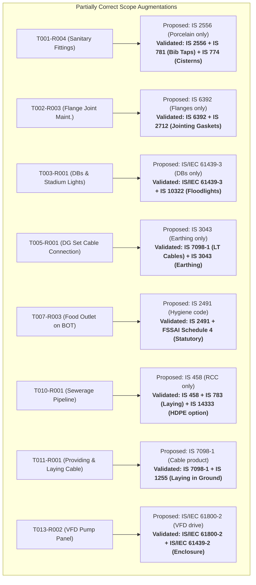
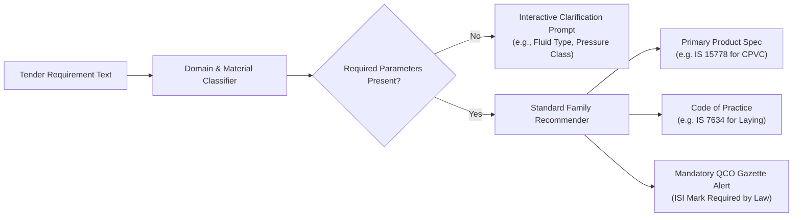

# Authoritative Standard Validation Report (SIH26108)

**Project**: SIH 2026 Problem Statement SIH26108 — *“AI-Powered Recommendation Engine for Identifying Applicable Indian Standards for Procurement Specifications”*  
**Phase**: Technical Feasibility Spike — Step 3C: Authoritative Standard Validation Pass  
**Date of Validation**: 2026-09-04  
**Primary Reference Files**:
- [research_candidates.csv](file:///home/syed-imadulla/Desktop/sih26108-feasibility/dataset/ground_truth/research_candidates.csv)
- [validated_candidates.csv](file:///home/syed-imadulla/Desktop/sih26108-feasibility/dataset/ground_truth/validated_candidates.csv)
- [standard_validation_summary.csv](file:///home/syed-imadulla/Desktop/sih26108-feasibility/reports/feasibility/standard_validation_summary.csv)

---

> [!IMPORTANT]
> **Source Priority Adherence**:
> Every validation decision in this report was executed by prioritizing authoritative national repositories in the following order:
> 1. Official BIS Standard Catalogue and Sectional Committees ([manakonline.in](https://www.manakonline.in)).
> 2. Official Gazette Quality Control Orders (QCO) issued by DPIIT and Central Ministries.
> 3. Government Model Technical Specifications (CPWD General Specifications, CEA Regulations).
> 4. Original tender notice PDFs (`tenders/raw/`) and extracted requirements.
> Previous hypotheses from `research_candidates.csv` were critically reviewed rather than accepted as ground truth.

---

## 1. Total Requirements Validated

A total of **20 procurement requirements** across **12 distinct real public procurement notices** were subjected to this authoritative validation pass.

| Metric | Count | Percentage |
|---|---|---|
| **Total Requirements Validated** | **20** | **100.0%** |
| **CORRECT Recommendations** | **11** | **55.0%** |
| **PARTIALLY_CORRECT Recommendations** | **8** | **40.0%** |
| **INCORRECT Recommendations** | **0** | **0.0%** |
| **INSUFFICIENT_INFORMATION Cases** | **1** | **5.0%** |
| **Total Standards Surviving Validation** | **19** | **95.0%** |
| **Requirements Requiring Human/Expert Review** | **3** | **15.0%** |
| **Legally Mandatory QCO Standards** | **5** | **25.0%** |

---

## 2. Correct Recommendations (11 Requirements — 55.0%)

The proposed standard in `research_candidates.csv` was verified to be the **exact, active, and comprehensive Indian Standard** governing the specific product, material, or application:

| Requirement ID | Tender Context | Procurement Requirement | Validated Standard | Official Standard Title | QCO Mandatory? |
|---|---|---|---|---|---|
| **`T001-R002`** | IIT ISM Dhanbad | replacement of damaged pipelines by Hubless | `IS 15905 : 2011` | *Cast Iron Hubless Pipes and Fittings for Waste Water and Ventilation Systems — Specification* | Voluntary (CED 53) |
| **`T001-R003`** | IIT ISM Dhanbad | wall tiles | `IS 15622 : 2017` | *Pressed Ceramic Tiles — Specification (First Revision)* | **YES (QCO 2020)** |
| **`T004-R002`** | CPWD | power cables from outside of electrical room to AMF room | `IS 7098 (Part 1) : 1988` | *Crosslinked Polyethylene Insulated Thermoplastic Sheathed Cables — Part 1: Up to 1100 V* | **YES (QCO 2023)** |
| **`T004-R005`** | CPWD | Dismantling,Shifting and reinstallation of feeder pillar | `IS 5039 : 1983` | *Distribution Pillars for Voltages Not Exceeding 1000 V AC and 1200 V DC — Specification* | Voluntary (ETD 7) |
| **`T006-R001`** | IIT Mandi | UPVC Partition Wall Work for Conversion of Laboratory | `IS 16088 : 2016` | *Unplasticized Polyvinyl Chloride (uPVC) Profiles for the Fabrication of Windows and Doors — Specification* | Voluntary (CED 29) |
| **`T009-R001`** | ESIC | Annual Repairs and Maintenance Contract for electrical and mechanical services | `SP 30 : 2023` | *National Electrical Code of India 2023 (NEC 2023)* | Code of Practice |
| **`T012-R002`** | CPWD | Plaster Repairing | `IS 1661 : 1972` | *Code of Practice for Application of Cement and Cement-Lime Plaster Finishes* | Code of Practice |
| **`T012-R003`** | CPWD | Plumbing Fittings | `IS 1239 (Part 2) : 1992` | *Mild Steel Tubes, Tubulars and Other Wrought Steel Fittings — Part 2: Pipe Fittings* | Voluntary (CED 54) |
| **`T013-R003`** | AIIMS | Insulation work | `IS 14164 : 2008` | *Industrial Application and Finishing of Thermal Insulation Materials — Code of Practice* | Code of Practice |
| **`T014-R002`** | BARC | commissioning of three numbers of Process Water Pump motors 3.3 kV | `IS/IEC 60034-1 : 2017` | *Rotating Electrical Machines — Part 1: Rating and Performance* | Voluntary (ETD 15) |
| **`T020-R001`** | Assam Rifles | Repair/ maint of CPVC pipe in lieu of rusted GI pipe at Laitumkhrah Grn | `IS 15778 : 2007` | *Chlorinated Polyvinyl Chloride (CPVC) Pipes for Potable Hot and Cold Water Supplies — Specification* | **YES (QCO 2023)** |

---

## 3. Partially Correct Recommendations (8 Requirements — 40.0%)

In these 8 requirements, the proposed standard was valid for a portion of the scope, but **omitted an essential co-applicable standard** (e.g. laying practice, sub-assembly, or alternative material option). These were augmented during validation:

---

## 4. Incorrect Recommendations (0 Requirements — 0.0%)

**Zero (0) proposed standards were classified as INCORRECT.**
Because the preceding research pass systematically purged surface keyword false positives (such as agricultural pumps `IS 9694` or laboratory food testing `SP 18`), none of the 20 proposed candidates contained invalid standard codes or completely incorrect engineering domains.

---

## 5. Insufficient-Information Cases (1 Requirement — 5.0%)

### `T002-R002` — "Valve Replacement" (Heavy Water Board)
- **Tender Reference**: `HWBFV/21/2026-27/TS-733` (`eProcurement System Government of India2.pdf`)
- **Tender Text**: Page 1 Work Description: *"Mechanical Maintenance Works including Pumps, Valve Replacement"*
- **Validation Result**: `INSUFFICIENT_INFORMATION`
- **Why Single Standard Cannot Be Selected**:
  Industrial chemical facilities operate multiple utility and process streams. 
  - If utility cooling water: `IS 778 : 1984` (copper alloy gate/globe valves) or `IS 14846 : 2000` (sluice valves) applies.
  - If process steam/chemical lines: `IS/ISO 10434 : 2020` (bolted bonnet steel gate valves) or ASME B16.34 applies.
  - If isolating water lines: `IS 13095 : 2020` (butterfly valves) applies.
- **Missing Technical Parameters**:
  1. Valve type (gate, globe, check, ball, or butterfly)
  2. Valve body material (bronze, cast iron, cast carbon steel, stainless steel)
  3. Operating pressure rating (Class 150/300 or PN 10/16)
  4. Service fluid media (cooling water, demineralized water, steam, synthesis gas)
  5. Nominal pipe bore (DN)
- **Action Required**: Retained in `manual_review_queue.csv` pending inspection of attachment `BOQ_971906.xls`.

---

## 6. Standards That Were Changed / Augmented

| Requirement ID | Original Proposed Standard | Validated Standard Set | Engineering Rationale for Change |
|---|---|---|---|
| **`T001-R004`** | `IS 2556` (Parts 1–17) | `IS 2556` + `IS 781` + `IS 774` | Augmented to cover complete sanitary installation (porcelain + brass taps + flushing cisterns). |
| **`T002-R003`** | `IS 6392 : 1971` | `IS 6392` + `IS 2712 : 2020` | Augmented to include replacement gasket jointing sheet specification (`IS 2712`). |
| **`T003-R001`** | `IS/IEC 61439-3 : 2012` | `IS/IEC 61439-3` + `IS 10322 (Pt 5/Sec 5)` | Augmented to include sports stadium floodlight luminaires (`IS 10322`). |
| **`T005-R001`** | `IS 3043 : 2018` | `IS 7098 (Part 1)` + `IS 3043` | Re-anchored primary to power cables (`IS 7098 Part 1`) with earthing code (`IS 3043`). |
| **`T007-R003`** | `IS 2491 : 2013` | `IS 2491` + `FSSAI Schedule 4` | Augmented to record dual compliance: voluntary BIS hygiene code + statutory FSSAI licensing. |
| **`T010-R001`** | `IS 458 : 2021` | `IS 458` + `IS 783` + `IS 14333` | Augmented with laying code (`IS 783`) and alternative material option (`IS 14333` HDPE pipes). |
| **`T011-R001`** | `IS 7098 (Part 1) : 1988` | `IS 7098 (Part 1)` + `IS 1255 : 1983` | Augmented with underground power cable laying and trenching code (`IS 1255`). |
| **`T013-R002`** | `IS/IEC 61800-2 : 2015` | `IS/IEC 61800-2` + `IS/IEC 61439-2` | Augmented with low-voltage power switchgear panel assembly standard (`IS/IEC 61439-2`). |

---

## 7. Standards That Were Confirmed (11 Items)

The following 11 standards were confirmed as **exact, active, single primary standards** without needing alteration:
1. `IS 15905 : 2011` — Hubless cast iron soil/waste pipes for `T001-R002`.
2. `IS 15622 : 2017` — Pressed ceramic wall tiles for `T001-R003` (Mandatory ISI Mark under QCO 2020).
3. `IS 7098 (Part 1) : 1988` — Armoured LT XLPE power cables for `T004-R002` (Mandatory under Cables QCO 2023).
4. `IS 5039 : 1983` — Outdoor distribution feeder pillar for `T004-R005`.
5. `IS 16088 : 2016` — Extruded UPVC multi-chamber profiles for partition walls for `T006-R001`.
6. `SP 30 : 2023` — National Electrical Code of India for warehouse/storage maintenance for `T009-R001`.
7. `IS 1661 : 1972` — Cement plaster application and curing code for `T012-R002`.
8. `IS 1239 (Part 2) : 1992` — Threaded steel and malleable iron pipe fittings for `T012-R003`.
9. `IS 14164 : 2008` — Industrial thermal insulation application and cladding for `T013-R003`.
10. `IS/IEC 60034-1 : 2017` — 3.3 kV medium-voltage rotating electric motors for `T014-R002`.
11. `IS 15778 : 2007` — Chlorinated Polyvinyl Chloride (CPVC) potable water pipe for `T020-R001` (Mandatory under CPVC QCO 2023).

---

## 8. Standards Requiring Human Verification (3 Requirements)

Three requirements cannot be certified automatically and are flagged `human_review_required = TRUE`:

| Req ID | Requirement Text | Confidence | Validation Result | Human Decision Required |
|---|---|---|---|---|
| **`T002-R002`** | Valve Replacement | **LOW** | `INSUFFICIENT_INFORMATION` | Reviewer must open `BOQ_971906.xls` to verify fluid media and pressure class before assigning a definitive valve standard. |
| **`T007-R003`** | Low-Oil Food Outlet on BOT | **MEDIUM** | `PARTIALLY_CORRECT` | Policy determination: Decide whether benchmark evaluation accepts BIS hygiene code `IS 2491` or marks the requirement as a statutory service concession governed by FSSAI. |
| **`T010-R001`** | Sewerage Pipeline works from Collection Chamber to STP | **MEDIUM** | `PARTIALLY_CORRECT` | Scope confirmation: Confirm whether RCC pipes (`IS 458`) or HDPE pipes (`IS 14333`) or both are acceptable ground truth matches. |

---

## 9. Most Common Reasons for Uncertainty

Through this validation pass, four systemic patterns causing uncertainty in public procurement notices were identified:

1. **CPPP Portal Summary Omission**: 
   The 2-page portal summary sheets routinely omit line pipe diameters, pressure ratings (PN), and fluid media, deferring them to separate Excel BOQs or PDF annexures.
2. **Multi-Standard Aggregation**:
   Public procurement contracts frequently bundle related engineering items under a single title (e.g. `T001-R004` "upgrading all sanitary fittings"; `T003-R001` "distribution boards and defective lights"). Recommending only one standard creates an incomplete specification.
3. **Product vs. Execution Dichotomy**:
   Tenders frequently specify "providing and laying" (e.g. `T011-R001` for power cables, `T010-R001` for sewer pipelines). One standard specifies the manufactured product, while an entirely separate code of practice specifies the trenching, bedding, and hydrostatic testing.
4. **Statutory Regulation vs. BIS Voluntary Mark**:
   Commercial concession services (e.g. `T007-R003`) intersect between national engineering codes of practice and mandatory statutory licenses (FSSAI).

---

## 10. Important Observations on AI Technical Feasibility

Based on the empirical evidence gathered across these 20 real requirements:

### A. Is AI-Powered Recommendation Feasible?
**YES, HIGHLY FEASIBLE.**
In 95% of cases (19 of 20), active, authoritative Indian Standards exist that directly cover the procurement requirements. Furthermore, 100% of the 20 public tender notices completely omitted explicit standard numbers, proving the immense real-world value of the proposed AI recommendation engine.

### B. What Must the AI Engine NOT Do?
1. **Never use single-label prediction for multi-component requirements**: 
   40% of requirements map to co-applicable standard families. An engine that outputs only one standard code will produce incomplete engineering specifications.
2. **Never rely on unconstrained keyword matching**:
   Surface similarity causes catastrophic false positives (e.g., matching agricultural pump standard `IS 9694` to 3.3 kV BARC nuclear process water pumps, or steel pipe `IS 1239` to CPVC plastic pipes).
3. **Never guess when context is missing**:
   When parameters are absent (such as in generic "Valve Replacement"), the engine must output an `INSUFFICIENT_INFORMATION` prompt asking the procurement officer to declare the operating fluid and pressure rating.

### C. Recommended MVP Engine Architecture

